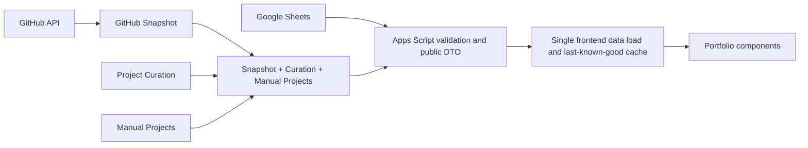

# Full Dynamic Portfolio Audit

## Final status

`FULL_DYNAMIC_PORTFOLIO_VERIFIED`

## Architecture

The browser performs one `getAllData` request per uncached page load. The validated response is stored as one central `window.portfolioData` state object and distributed to renderers. Components do not fetch Sheet data independently.

## Static-content audit

| Classification | Findings | Decision |
| --- | --- | --- |
| Portfolio content | Profile identity fallbacks, resume URL, chatbot identity/welcome, profile/about copy, section headings, footer, FAQ, personal SEO | Converted to public `profile` or `config` DTO fields |
| Configuration | Section headings, footer text, chatbot labels, site title, description, keywords, canonical URL, social metadata | Strictly allowlisted through Apps Script and consumed at runtime |
| GitHub-owned data | Repository identity, URL, homepage, topics, language, status and discovered screenshots | Remains in GitHub Snapshot and the merged server-side project DTO |
| Sheet-owned curation | Publication, featured state, order, editorial title/description, category, image and highlights | Remains in Project Curation or Manual Projects |
| Static design labels | Navigation names, form labels, button commands, loading/error text, project link commands | Intentionally static because these describe UI behavior, not portfolio facts |
| System constants | Apps Script endpoint, schema version, cache key, dashboard route, security limits | Intentionally static deployment/runtime configuration |
| Crawl-time fallback | Initial HTML title/meta/JSON-LD | Retained as a no-JavaScript and social-crawler fallback; runtime metadata is replaced from the DTO |

## Converted content

- Removed hard-coded fallback name and professional title from the profile renderer.
- `HeroQuote`, `Bio`, and `AboutMe` now serve distinct intended locations with safe fallback from AboutMe to Bio.
- Resume link now uses `Profile.ResumeURL` and remains hidden when unavailable.
- Social links, email, phone, location, and profile image remain sourced exclusively from `Profile`.
- Removed the hard-coded remote profile-image fallback; a responsive initials state is used if the configured manual image fails.
- Removed the hard-coded Unsplash certificate fallback; missing images use a neutral presentation state.
- Added API-backed FAQ rendering with active/order filtering performed server-side.
- Added a footer using `Config.footer_text`, with a dynamic year/name fallback.
- Applied configurable headings for About, Skills, Projects, Certificates, Blogs, Experience, FAQ, and Contact.
- Applied `chatbot_name` and `chatbot_welcome` from public configuration.
- Runtime title, description, keywords, canonical, Open Graph, Twitter metadata, and JSON-LD now derive from allowlisted config, profile, and skills.

## Sheet, API, and frontend mapping

| Public section | Sheet source | Apps Script mapping | Frontend consumer |
| --- | --- | --- | --- |
| `profile` | Profile | `buildPublicProfile_` strict allowlist | `renderProfile`, `applyPortfolioContent`, `buildPortfolioSEO` |
| `config` | Config key/value table | `buildPublicConfig_` / `SAFE_CONFIG_KEYS` | Section headings, chat, footer and runtime SEO |
| `skills` | Skills | `mapPublicTable_` active/order filtering | `renderSkills`, SEO knows-about list |
| `projects` | Snapshot + Curation + Manual Projects | `buildPublicProjects_` merged public DTO | `renderProjects` |
| `experience` | Experience | `mapPublicTable_` active/order filtering | `renderTimeline` |
| `education` | Education | `mapPublicTable_` active/order filtering | `renderTimeline` |
| `certificates` | Certificates | published/order filtering and field allowlist | `renderCertificates` |
| `blogs` | Blogs | `extractDynamicBlogsWithDocs` | `renderBlogs` and article modal |
| `faq` | FAQ | active/order filtering and field allowlist | `renderFAQ` |
| `aiContext` | Legacy public AI context only | strict public mapping | Preserved for API compatibility; private prompt/knowledge stay server-only |

## Image mapping

- Profile, manual projects, certificates, and blog thumbnails use manually configured public DTO URLs.
- GitHub project screenshots retain automatic discovery, curation override, last-known-good, GitHub OG, and neutral-card fallback behavior.
- Missing or failed images do not alter project publication or break layout.
- No working manual image reference is replaced by GitHub discovery.

## SEO mapping and limitation

Config now supports explicit public-safe fields: `site_title`, `meta_description`, `meta_keywords`, `canonical_url`, `og_title`, `og_description`, `og_image`, `twitter_title`, `twitter_description`, `site_name`, and `language`. Runtime metadata and structured data update on every successful API load.

GitHub Pages serves static HTML before JavaScript executes. Initial crawl-time metadata therefore remains a checked-in fallback for crawlers that do not execute JavaScript. Fully dynamic link-preview metadata would require server-side rendering or an edge/server deployment and is outside the approved Google Sheets -> Apps Script -> static frontend architecture.

## Security review

- Raw Sheet rows are never returned.
- Empty headers cannot create public properties.
- Public config and profile fields use explicit server allowlists.
- Private AI prompt, reviewed private knowledge, passwords, tokens, credentials, internal sync state, and admin properties remain excluded.
- URLs are sanitized client-side before insertion and rendered text is escaped.
- GitHub technical metadata remains server-owned; frontend code does not read snapshot or curation sheets.

## Automatic-update behavior

Supported Sheet changes are visible on the next uncached page load through Version 25 without a frontend redeployment. The existing short server cache and browser last-known-good cache remain resilience mechanisms; they can temporarily serve the prior validated payload during an API outage. Dashboard writes invalidate the public server cache.

## Verification

- Unit/contract tests: **52/52 passed**.
- Offline Playwright checks using the captured production DTO: **5/5 passed**.
- Desktop viewport: dynamic identity, skills, projects, FAQ, footer and runtime SEO passed; no overflow or runtime errors.
- Mobile viewport: same checks passed; no overflow or runtime errors.
- Production API Version 25: HTTP **200**, JSON content type, `success: true`, schema version **1**.
- Required sections: all ten present.
- Production collection counts at verification: 8 skills, 7 projects, 3 experience, 2 education, 6 certificates, 11 blogs, and 18 FAQ entries.
- Security scan: no private prompt or credential keys found in the public response.
- Exactly one logical anonymous `getAllData` verification request was made. It may create one normal VisitorLog entry; no other production data was written.
- GitHub Pages deployment for commit `f4a1256` completed successfully.

No temporary production content mutations were performed. Mutating nine representative production records and restoring them would add avoidable risk and requests; the same mapping paths are covered by isolated contract tests plus the captured live DTO rendering test.

## Remaining hard-coded content

- Navigation and form labels: stable interface structure.
- Button, loading, empty-state, and error messages: application behavior.
- API/deployment URLs and schema/cache identifiers: system configuration.
- Initial HTML metadata: static-hosting crawler fallback described above.
- Generated static blog article pages and search/RSS/sitemap artifacts: publishing outputs, not homepage data records; they continue to be regenerated by the existing blog publishing workflow.

## Dashboard continuation

The Master Dashboard System/Light/Dark theme increment was completed alongside this audit. It uses centralized semantic tokens, defaults to operating-system preference, switches instantly, persists manual choices, and passed desktop/mobile browser verification. Owner bootstrap was not rerun, and `syncGitHubProjects` was not executed.
