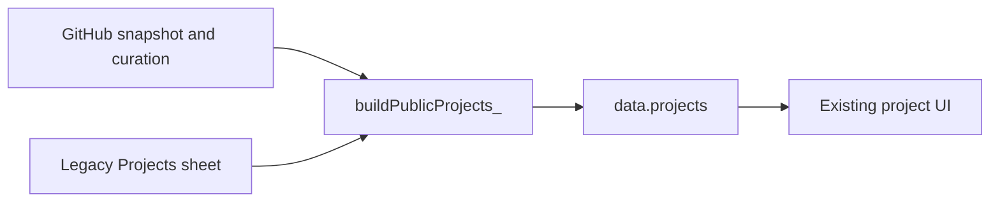
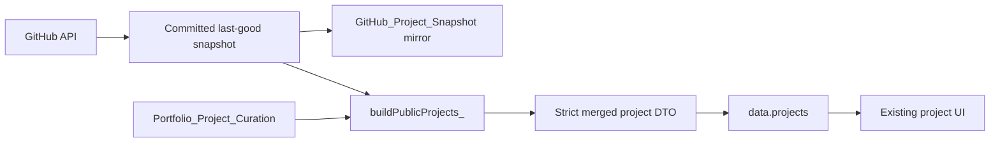

# GitHub Projects Portfolio Integration

**Integration date:** 2026-08-08  
**Baseline:** Apps Script Version 19  
**Production release:** Apps Script Version 20  
**Deployment ID:** `AKfycbwmQcArmH_TZ9Y8mP_XiyWgSCzU1QpmK7Iw3y5exUOKenl6p4ZOhTd7dxh-E8fpeJj1Mg`

## Result

The production `projects` DTO now uses only the committed GitHub snapshot joined to `Portfolio_Project_Curation`. The legacy `Projects` sheet and its data remain intact for rollback/reference but are no longer read by `buildPublicProjects_()`.

The existing project card layout was retained. Only thumbnail accessibility and failure handling were added.

## Old Data Flow



The old builder appended published legacy rows whenever a GitHub-backed row was not already published under the same normalized name.

## New Data Flow



Publication requires all of the following:

- repository `sync_state` is `active`;
- repository visibility is `public`;
- repository is not disabled;
- a curation row exists for the immutable GitHub repository ID;
- `show_on_portfolio` is true;
- archived repositories have an explicitly reviewed `completed` or `historical` portfolio status.

Newly synchronized repositories remain unpublished because curation reconciliation defaults both `show_on_portfolio` and `featured` to false.

## Legacy-To-GitHub Mapping

| Legacy project | Mapping result | Production result |
|---|---|---|
| Wealth OS | Confirmed as `itsmebillah/Wealth-OS`, repository ID `1268515486`, by normalized name and exact homepage | Migrated and published through curation |
| Autopilot Business System | No reliable GitHub match | Legacy row preserved; not emitted by the GitHub-only DTO |
| Car Sales Analysis | No reliable GitHub match | Legacy row preserved; not emitted by the GitHub-only DTO |
| HR Analytics Dashboard | No reliable GitHub match | Legacy row preserved; not emitted by the GitHub-only DTO |

No repository associations were guessed.

## Publication Counts

- GitHub snapshot records: 15
- Published GitHub-backed projects: 1
- Unpublished GitHub-backed projects: 14
- Unresolved legacy projects retained for review: 3
- Legacy rows deleted or modified: 0

## Wealth OS Curation Migration

The confirmed record at `Portfolio_Project_Curation!A24:P24` now preserves:

- visibility: published;
- featured status: true;
- display order: 4, matching its fourth-row legacy position;
- category: the existing legacy value;
- custom title: `Wealth OS`;
- custom description: `Your Personal Wealth Intelligence Platform`;
- portfolio image: the existing project screenshot;
- technology presentation: the existing legacy stack text;
- demo URL: the existing Vercel deployment;
- KPI/highlight: the existing legacy value;
- portfolio status: active.

The source `Projects` row was not edited.

## GitHub Metadata Used

The merged public entry now receives these technical facts from GitHub:

- immutable repository ID;
- repository key and repository name;
- repository URL;
- base description when no custom description exists;
- homepage when no curated demo override exists;
- topics;
- primary language;
- active/archived/disabled state;
- README documentation URL;
- last-updated timestamp.

The public mapper remains a strict allowlist. Snapshot internals, private Sheet columns, visibility notes, credentials, and private AI context are not exposed.

## Curation Fields Preserved

GitHub synchronization does not overwrite:

- `show_on_portfolio`;
- `featured`;
- `display_order`;
- `section`;
- `category`;
- `custom_title`;
- `custom_description`;
- `portfolio_image`;
- `tech_stack_override`;
- `demo_url_override`;
- `kpi_highlight`;
- `portfolio_status`;
- review notes and timestamps.

## Thumbnail Resolution

The resolver uses this hierarchy:

1. A valid HTTPS `portfolio_image` curation override.
2. GitHub's repository Open Graph image at `opengraph.githubassets.com`.
3. The existing in-card `Project preview unavailable` placeholder if the browser cannot load the selected image.

GitHub generates an Open Graph image even when a repository has no custom social preview, so normal repository publication does not require a manually pasted thumbnail. No screenshot service or new third-party dependency was introduced.

The public DTO also supplies concise image alt text in the form `[Project title] project preview`. Images remain lazy-loaded, asynchronously decoded, dimensioned, responsive, and protected against layout shift. A one-time browser error listener replaces a broken image with the existing fixed-size placeholder.

## API Changes

- Response envelope: unchanged.
- Schema version: unchanged at `1`.
- Other public sections: unchanged.
- `projects` field shape: backward compatible.
- Added optional project field: `imageAlt`.
- Internal source: changed from GitHub-plus-legacy fallback to GitHub snapshot plus curation only.
- Public cache key: advanced to contract 11 to prevent Version 19 project data from remaining cached.

## Frontend Changes

The project card structure, content hierarchy, controls, styling, and responsive layout were not redesigned.

The only frontend behavior changes are:

- consume `imageAlt` when supplied;
- keep a generated descriptive fallback alt value;
- replace a failed project image with the existing unavailable-preview block.

## Verification

### Automated Checks

- Node unit tests: 29/29 passed.
- Apps Script JavaScript syntax: passed.
- Frontend project module syntax: passed.
- Git diff whitespace validation: passed.
- Explicit regression test confirms `buildPublicProjects_()` does not read `Projects`.
- Private and unavailable repository exclusion tests: passed.
- New-repository default-unpublished test: passed.
- Curated override and automatic-thumbnail tests: passed.

### Production API

One anonymous `getAllData` request after Version 20 activation returned:

- HTTP 200;
- `application/json; charset=utf-8`;
- `success: true`;
- schema version 1;
- all required sections: profile, config, skills, projects, experience, education, certificates, blogs, faq, and aiContext;
- one project;
- project ID `1268515486`;
- repository key `itsmebillah/Wealth-OS`;
- featured status true;
- no private AI prompt;
- no legacy demo credentials.

The direct API verification created one VisitorLog row at `2026-08-08 23:21:43`. Live Edge/Playwright rendering checks created seven additional rows between `23:25:22` and `23:31:01`. These eight rows contain only a hashed client identifier and the `getAllData` action. No other production data was modified by verification.

### Link And Image Checks

The following returned HTTP 200:

- curated Wealth OS screenshot (`image/png`);
- automatic GitHub Open Graph fallback (`image/png`);
- Wealth OS demo (`text/html`);
- Wealth OS GitHub repository (`text/html`).

### Live Portfolio Rendering

- GitHub Pages deployment run `31269317731`: passed.
- Desktop viewport `1440x900`: one featured Wealth OS card, working image, correct alt text, no unresolved legacy cards, no page error, and no horizontal overflow.
- Mobile viewport `390x844`: one featured Wealth OS card, working 320-pixel source image, correct alt text, no unresolved legacy cards, no page error, and no horizontal overflow.
- Existing project layout and responsive stacking remain intact.

## Rollback

### Immediate Production Rollback

Repoint the existing deployment to Version 19:

```powershell
clasp deploy -i AKfycbwmQcArmH_TZ9Y8mP_XiyWgSCzU1QpmK7Iw3y5exUOKenl6p4ZOhTd7dxh-E8fpeJj1Mg -V 19 -d "Rollback to Version 19"
```

Version 19 retains the legacy compatibility read. The legacy `Projects` sheet is unchanged and remains available.

### Curation Rollback

After a Version 19 rollback, set `Portfolio_Project_Curation!C24:D24` back to false only if the GitHub-backed Wealth OS record must also be unpublished. Do not delete the row.

### Frontend Rollback

Revert the integration commit through a normal follow-up commit and push. Do not rewrite history or force-push.

## Unresolved Work

Autopilot Business System, Car Sales Analysis, and HR Analytics Dashboard have no authoritative GitHub repository identity. They need an approved manual-case-study model or confirmed repository mappings before they can return to a GitHub-only production project DTO.

No Dashboard work was started.

## Final Status

**GITHUB_PROJECT_SOURCE_INTEGRATED**
