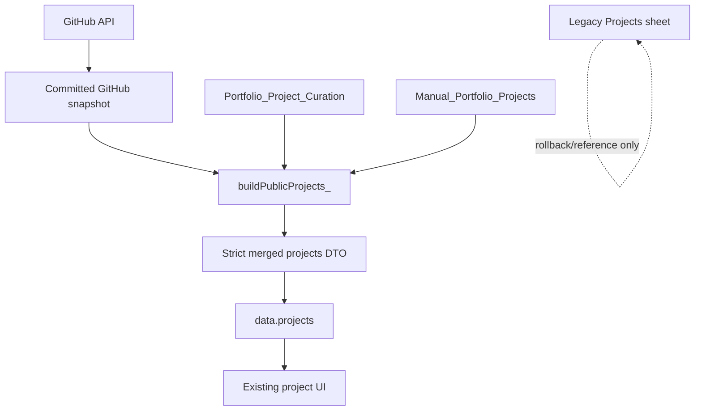

# Hybrid Project Source Integration

**Integration date:** 2026-08-08
**Production Apps Script version:** 21
**Deployment ID:** `AKfycbwmQcArmH_TZ9Y8mP_XiyWgSCzU1QpmK7Iw3y5exUOKenl6p4ZOhTd7dxh-E8fpeJj1Mg`
**Spreadsheet:** [Masum Portfolio Database](https://docs.google.com/spreadsheets/d/1ZnoWdyyqzutrIs6SBnYfwN3a9aVsPNPJjzw9lWu76iE/edit)

## Result

The production portfolio now merges two legitimate project sources into one source-agnostic public DTO:

1. GitHub repositories joined to `Portfolio_Project_Curation` by immutable repository ID.
2. Non-GitHub portfolio work stored in `Manual_Portfolio_Projects` by stable manual project ID.

The existing project UI was not redesigned. GitHub synchronization logic, triggers, snapshot data, and curation reconciliation were not changed.

## Architecture



## Manual Project Source

Created `Manual_Portfolio_Projects` with these columns:

`manual_project_id`, `title`, `description`, `category`, `display_order`, `featured`, `show_on_portfolio`, `kpi_highlight`, `image`, `image_alt`, `demo_url`, `tech_stack`, `portfolio_status`, `last_reviewed_at`

Controls include:

- stable lowercase slug IDs;
- native checkbox validation for featured and publication state;
- controlled portfolio-status values;
- frozen header and filter;
- bounded column widths and wrapped narrative fields.

## Migrated Manual Projects

| Stable ID | Title | Order | Featured | Published | Repository identity |
|---|---|---:|---:|---:|---|
| `autopilot-business-system` | Autopilot Business System | 1 | false | true | None |
| `car-sales-analysis` | Car Sales Analysis | 2 | false | true | None |
| `hr-analytics-dashboard` | HR Analytics Dashboard | 3 | false | true | None |

The migration preserves the existing titles, descriptions, KPI where present, images, demo links, technology labels, visibility, and ordering. No fake GitHub repository ID, key, or URL was added.

The source rows in the legacy `Projects` sheet remain unchanged and available for rollback.

## Public DTO Rules

### GitHub Projects

- Identity: numeric GitHub repository ID.
- `source`: `GITHUB`.
- Technical metadata: GitHub snapshot.
- Publication and presentation: GitHub curation.
- Thumbnail: curated image, automatically discovered repository screenshot, then GitHub Open Graph image.
- Newly synchronized repositories remain unpublished by default.

### GitHub Screenshot Discovery

Each successful metadata refresh inspects public repository content and stores only the selected screenshot metadata in the snapshot:

- `screenshot_url`;
- `screenshot_path`;
- `screenshot_alt`;
- `screenshot_source`;
- `screenshot_discovery_status`.

Selection order is:

1. Manual `portfolio_image` curation override.
2. Representative screenshot referenced by the repository README.
3. Representative screenshot from repository image, screenshot, documentation, media, or public folders.
4. GitHub Open Graph image.
5. Existing in-card unavailable-preview fallback when the selected image cannot load.

The selector rejects social-preview cards, Open Graph assets, badges, shields, avatars, logos, wordmarks, favicons, icons, banners, and technology graphics. It prefers dashboard, analytics, reporting, workspace, storefront, homepage, upload, pricing, subscription, desktop, and production-state images. A temporary GitHub content-discovery failure preserves the last known good screenshot rather than replacing it with a weaker image.

Stable raw GitHub URLs are generated from the repository key, default branch, and selected path. Private repositories never enter discovery or the public snapshot.

Focused selector tests cover:

- Sales-Dashboard dashboard overview;
- Wealth OS manual override priority;
- SubPro subscription interface;
- Reyon-Online storefront interface;
- InsightFlow AI upload interface;
- a repository without a suitable screenshot using the OG fallback.

### Manual Projects

- Identity: `manual:<manual_project_id>`.
- `source`: `MANUAL`.
- `repoKey`: empty.
- Repository URL: empty.
- Presentation and publication: manual project sheet.
- Thumbnail: manually configured HTTPS image.
- Missing/broken image: existing fixed-size unavailable-preview fallback.

Duplicate or invalid manual IDs are excluded. Both project types are mapped through strict allowlists and sorted by `displayOrder`, followed by title. The existing UI independently separates featured and standard cards.

## Current Production Result

Version 21 currently returns six unique projects:

| ID | Source | Title | Featured | Order |
|---|---|---|---:|---:|
| `manual:autopilot-business-system` | MANUAL | Autopilot Business System | false | 1 |
| `manual:car-sales-analysis` | MANUAL | Car Sales Analysis | false | 2 |
| `manual:hr-analytics-dashboard` | MANUAL | HR Analytics Dashboard | false | 3 |
| `1268515486` | GITHUB | Wealth OS | true | 4 |
| `1314985175` | GITHUB | Sales-Dashboard | false | default |
| `1136408699` | GITHUB | SubPro | false | default |

Sales-Dashboard and SubPro remain visible because their existing curation has `show_on_portfolio = true`. This integration did not change that state.

## API Verification

The anonymous production endpoint returned:

- HTTP 200;
- `application/json; charset=utf-8`;
- `success: true`;
- schema version 1;
- all required sections: profile, config, skills, projects, experience, education, certificates, blogs, faq, and aiContext;
- three GitHub projects and three manual projects;
- zero duplicate IDs;
- zero legacy IDs;
- zero fake manual repository keys or URLs;
- zero private repositories;
- no private AI prompt;
- no demo credentials.

## Link And Image Verification

- All three manual image URLs returned HTTP 200.
- Both Power BI demo URLs returned HTTP 200.
- The Autopilot Apps Script demo returned HTTP 200 for an anonymous GET. It rejects HEAD requests, which does not affect browser navigation.
- GitHub Open Graph thumbnails for GitHub projects returned HTTP 200 `image/png`.
- All six images decoded successfully in the final mobile browser check.
- All six images have descriptive alt text.
- A forced image-failure test hid all six broken images and displayed six fixed-size fallback blocks without removing or resizing cards.

## UI Verification

No UI source branching was introduced. The existing renderer consumes the same public project shape for both sources.

Desktop `1440x900` and mobile `390x844` verified:

- Wealth OS remains the sole featured card;
- Autopilot Business System, Car Sales Analysis, and HR Analytics Dashboard appear in order;
- Sales-Dashboard and SubPro retain current standard-card behavior;
- six unique cards render;
- responsive layout remains intact;
- no horizontal overflow;
- no JavaScript page errors;
- image fallback preserves layout.

## Automated Verification

- Unit tests: 31/31 passed.
- Apps Script syntax checks: passed.
- Frontend project module syntax: passed.
- Diff whitespace check: passed.
- Manual publication gating: passed.
- Stable-ID and duplicate suppression: passed.
- Strict allowlisting: passed.
- GitHub publication behavior: unchanged and passed.
- Private/unavailable GitHub exclusion: passed.

## Production Safety

- No GitHub synchronization was run.
- No synchronization trigger was installed or changed.
- No GitHub snapshot row was modified.
- No GitHub curation row was modified.
- No legacy `Projects` row was modified or deleted.
- No unrelated Sheet tab was modified.
- No portfolio UI redesign was performed.
- No Dashboard work was started.

## Rollback

### Apps Script

Repoint the existing deployment to Version 20:

```powershell
clasp deploy -i AKfycbwmQcArmH_TZ9Y8mP_XiyWgSCzU1QpmK7Iw3y5exUOKenl6p4ZOhTd7dxh-E8fpeJj1Mg -V 20 -d "Rollback to Version 20"
```

Version 20 ignores `Manual_Portfolio_Projects` and returns only curated GitHub projects.

### Sheet Data

Do not delete `Manual_Portfolio_Projects` during a code rollback. Keeping it intact allows Version 21 to be restored without remigration. The legacy `Projects` sheet remains the original reference copy.

### Repository

Use a normal revert commit for the hybrid-source implementation. Do not rewrite history or force-push.

## Final Status

**HYBRID_PROJECT_SOURCE_VERIFIED**
