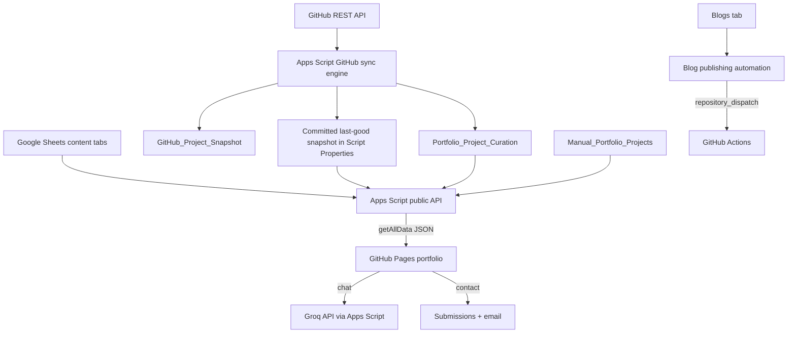
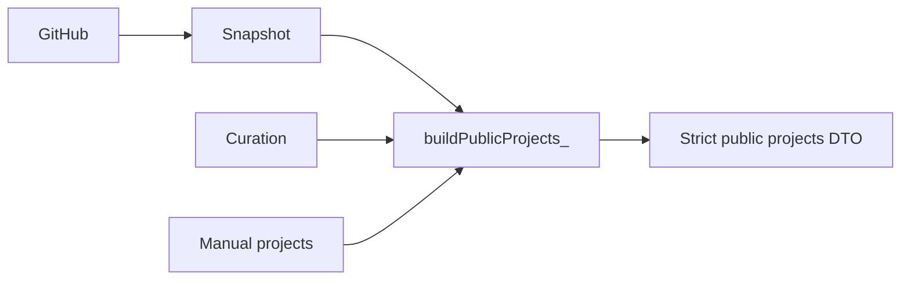

# Master Portfolio Dashboard Architecture

**System:** Masum Portfolio CMS and administration plane  
**Audit date:** 2026-08-09  
**Mode:** Read-only architecture discovery  
**Spreadsheet:** `Masum_Portfolio_Database` (`1ZnoWdyyqzutrIs6SBnYfwN3a9aVsPNPJjzw9lWu76iE`)  
**Apps Script project:** `1LwNLZml4hNvNMB6KELIC5HurPd5Ig2OEoFonSKwA1VBkhysGiGECBK-H`

## Executive Summary

The dashboard is feasible without replacing Google Sheets or changing the public portfolio contract. It should be implemented as an authenticated Apps Script HTML application backed by an explicit, allowlisted admin service layer. The browser must never receive a generic Sheet API, Script Properties, private AI data unless specifically requested by an authenticated editor, credentials, or raw logs.

The public website currently calls an anonymous Apps Script web app for `getAllData`, `chat`, and contact submission. There is no admin authentication, session model, admin DTO, or content mutation API. Those controls must be added before any dashboard module can write data.

Two current-state corrections are important:

1. The production deployment has progressed beyond Version 20. Version 22 was deployed for repository screenshot discovery; it must remain the baseline for future staging and regression comparisons.
2. The live `GitHub_Sync_Status` row reports `failed`, `SHEET_SCHEMA_CONFLICT`, with the last successful sync at `2026-08-08T17:05:54.729Z`. The snapshot tab now has a 30-column grid, but its returned header row still contains the earlier 25-field schema. Resolve and verify this pre-existing synchronization state before implementing the dashboard Sync Center.

No Sheet data, Apps Script deployment, trigger, public API, or production portfolio file was changed during this audit.

## 1. Current Architecture

The frontend does not read Google Sheets directly. `assets/js/api.js` calls the configured Apps Script deployment with `action=getAllData`; the response is passed to the existing render modules. Contact uses form-encoded POST. Chat currently supports GET and JSON/form POST. The deployed manifest executes as `USER_DEPLOYING` and allows `ANYONE_ANONYMOUS`, which is appropriate for public reads but insufficient by itself for admin authorization.

## 2. Complete Sheet Inventory

The workbook contains 18 visible grid tabs. No hidden tab was reported by the Sheets metadata response. No named ranges were returned by the available metadata response. The sampled schema cells contained no formulas; implementation must still preserve formulas if later rows or future schemas introduce them.

| Tab | Sheet ID | Current headers | Role | Dashboard treatment |
|---|---:|---|---|---|
| Profile | 1671778120 | Name, Title, HeroQuote, Email, Phone, Location, Bio, AboutMe, YearsExperience, CurrentRole, CurrentCompany, Facebook, LinkedIn, WhatsApp, GitHub, ResumeURL, ProfilePic, HeroBG, sex, Age, Maritial status | Single-row personal/profile record | Edit only approved professional fields. Treat sex, age, and marital status as private/non-editable until intentionally removed or classified. |
| Visitors | 951762481 | Timestamp, Date, Hour, Page, Source | Legacy analytics events | Read-only aggregate reporting; no CRUD. Confirm whether still written before exposing metrics. |
| Config | 662271409 | Key, Value | Public presentation configuration | Allowlist meaningful keys; never expose arbitrary key/value editing. |
| Projects | 1375068017 | Name, Category, Description, ProblemSolved, Impact, TechStack, Image, Tags, LiveURL, GitHubURL, Featured, DemoEmail, DemoPassword, Published | Legacy rollback source | Read-only rollback archive. Contains credentials and must never be returned by admin list DTOs or copied into new project records. |
| Skills | 745515310 | Name, Level, Category, Description, Order | Public skills | CRUD after stable row IDs and explicit active state are added. Existing `Order` values are not consistently numeric and require validation planning. |
| Experience | 195532833 | Title, Company, Period, Description, SkillsUsed, Achievements, Icon | Public employment history | CRUD after stable IDs, active state, and normalized order are introduced. |
| Education | 251458671 | Degree, Institution, Period, Description, Result, Icon | Public education | CRUD after stable IDs, active state, and normalized order are introduced. |
| Certificates | 1595113248 | Name, Organization, Date, Description, CredentialID, ImageURL, VerifyURL, Skills, Published | Public certificates | CRUD with publication control, URL validation, and stable IDs. |
| Blogs | 1890199050 | Title, Slug, Description, Content, Keywords, ReadTime, Thumbnail, Category, DocID, Date, Published, Author | Blog CMS source | CRUD with slug uniqueness, HTML sanitization policy, draft/publish controls, and optional Docs content source. Do not invent tags or SEO columns until a schema migration is approved. |
| FAQ | 169152671 | Question, Answer, Category | Public FAQ | CRUD after stable IDs, active state, and order fields are introduced. |
| AI_Prompt | 626112070 | Key, Value | Private server-side AI configuration | Authenticated, step-up protected editor only. Never include in public or general overview DTOs. |
| Submissions | 1488461366 | Timestamp, Name, Email, Subject, Message, Status, SubmissionID | Private contact inbox | Read/update status only. Mask email in list views where practical; no public exposure or bulk delete initially. |
| VisitorLog | 554649537 | Timestamp, VisitorID, Page, Referrer, ScreenSize, UserAgent, TimeSpent | Operational request/activity log | Read-only aggregates and bounded recent entries. Current rows also record action payloads; avoid exposing message text and identifiers unnecessarily. |
| AI_Knowledge | 1094077288 | Type, Title, Content | Private server-side AI knowledge | Authenticated, step-up protected CRUD; never send through public API or log content. |
| GitHub_Project_Snapshot | 2100000001 | 30 intended fields; current returned row still shows the original 25 fields through missing_since | GitHub-owned technical metadata mirror | Read-only in dashboard. Sync engine alone writes it. Show repository and screenshot status from an allowlisted DTO. |
| Portfolio_Project_Curation | 2100000002 | github_repository_id, repo_key, show_on_portfolio, featured, display_order, section, category, custom_title, custom_description, portfolio_image, tech_stack_override, demo_url_override, kpi_highlight, portfolio_status, visibility_note, last_reviewed_at | Portfolio-owned GitHub presentation | Editable except immutable identity fields. Use optimistic concurrency and validation. |
| GitHub_Sync_Status | 2100000003 | last_attempt_at, last_success_at, status, http_status, repository_count, etag, failure_count, next_retry_at, error_code | Sync health | Read-only to users; sync engine writes it. Do not expose ETag unless needed diagnostically. |
| Manual_Portfolio_Projects | 2100000004 | manual_project_id, title, description, category, display_order, featured, show_on_portfolio, kpi_highlight, image, image_alt, demo_url, tech_stack, portfolio_status, last_reviewed_at | Portfolio-owned non-GitHub projects | Full controlled CRUD. Archive by default; hard delete only after explicit confirmation. |

### Existing Gaps In Editable Schemas

Several requested controls do not exist in the current data model. Skills, Experience, Education, and FAQ have no stable ID, active flag, or display order in some cases. Blogs have no distinct SEO title/description, tags, or explicit status beyond `Published`. Profile is a single horizontal record. There is no Media, SEO, Admin User, Session, or Admin Audit Log tab.

These are migration requirements, not fields the first dashboard build may silently invent. Each new column/tab needs a versioned migration, backup, validation, rollback procedure, and public-contract regression test.

## 3. Field Ownership And Exposure

| Category | Source of truth | Admin rights | Public exposure |
|---|---|---|---|
| GitHub ID, name, description, repository URL, homepage, topics, language, stars, forks, state, timestamps, discovered screenshot | GitHub snapshot | Read-only | Allowlisted through merged project DTO only when published |
| GitHub project publication, featured, order, category, overrides, KPI, image override, portfolio status | Project Curation | Read/write | Only merged, published values |
| Manual project content and presentation | Manual Projects | CRUD/Archive | Published records only |
| Legacy project rows and demo credentials | Projects | Read-only rollback | Credentials never; legacy records no longer a production source |
| Profile professional content and links | Profile | Read/write allowlist | Existing public profile allowlist |
| Sex, age, marital status and unsupported personal fields | Profile | Hidden by default | Never |
| Skills/career/education/certificates/FAQ | Respective tabs | Controlled CRUD | Existing strict DTO fields; publication filters where supported |
| Blog content | Blogs/optional Google Doc | Controlled CRUD | Published fields only |
| Public UI config | Config | Key-specific editing | Existing public key allowlist |
| AI prompt and knowledge | AI_Prompt, AI_Knowledge | Step-up protected editing | Never; server-side Groq context only |
| Contact submissions | Submissions | Read/status update | Never |
| Visitor data | Visitors, VisitorLog | Read-only aggregate | Never |
| Secrets and GitHub tokens | Script Properties | No dashboard read API | Never |
| Admin credentials and sessions | New Script Properties/user store | Authentication service only | Never |

## 4. Current API Map

| Route/action | Method | Authentication | Reads/writes | Notes |
|---|---|---|---|---|
| `health` | GET | Anonymous | None | Returns service/schema health envelope. |
| `getAllData` | GET | Anonymous | Reads public content; writes VisitorLog | Cached for 600 seconds; strict public DTO builders. |
| `chat` | GET or POST | Anonymous, rate-limited | Reads private AI context server-side; calls Groq; writes VisitorLog | Private prompt/knowledge are not returned. Prefer POST-only in later hardening. |
| Contact/default POST | POST | Anonymous, rate-limited | Appends Submissions and sends email | Explicit validation and Sheet formula neutralization exist. |
| `syncGitHubProjects` | Server function/trigger | Owner execution | GitHub, Script Properties, snapshot/curation/status tabs | Script lock, staged snapshot, validation, rollback, last-known-good behavior. Not currently an HTTP admin action. |
| Blog publishing functions | Installable triggers/server functions | Owner execution | Script Properties and GitHub repository dispatch | Separate lock/retry state; must remain independent of dashboard sessions. |

### Required Admin API

Add a logically separate command router. Each command must have a fixed request schema, authorization requirement, validation function, service function, and allowlisted response DTO. Do not accept a sheet name, arbitrary range, arbitrary property key, or arbitrary action-to-function name from the browser.

Recommended command families:

- `admin.auth.login`, `admin.auth.changePassword`, `admin.auth.logout`, `admin.auth.session`;
- `admin.overview.read`;
- `admin.profile.read/update`;
- `admin.skills.list/create/update/archive` and equivalent explicit commands for career entities;
- `admin.projects.github.list/updateCuration`;
- `admin.projects.manual.list/create/update/archive`;
- `admin.blogs.list/create/update/archive/publish`;
- `admin.faq.list/create/update/archive`;
- `admin.config.read/updateAllowed`;
- `admin.media.list/register/archive` after its schema exists;
- `admin.ai.read/update` with step-up authorization;
- `admin.sync.status/run` with locking and rate-limit checks;
- `admin.activity.list` with bounded pagination.

All mutations must invalidate the public cache only after a successful write and must return the stored, re-read entity version.

## 5. Authentication Design

### Recommended Model

Use Apps Script's deployed HTML service for the dashboard shell and `google.script.run` for authenticated RPC, while keeping the public JSON endpoint unchanged. Because the production web app allows anonymous public access, the dashboard cannot rely on the Google account identity supplied by the deployment. It needs application-level authentication.

For the single initial administrator:

1. Store the normalized admin email and password verifier in Script Properties, never in a public Sheet.
2. Provision the requested temporary password out-of-band through a one-time owner function. Do not place `123456` in source control, frontend JavaScript, logs, or API payload examples.
3. Derive a verifier using a memory/work-factor password KDF. Apps Script lacks a native modern password KDF; prefer an external managed identity provider or Google Identity Platform. If constrained to Apps Script only, use a reviewed PBKDF2-HMAC-SHA256 implementation with a unique random salt, high iteration count, algorithm/version metadata, and constant-time comparison.
4. Mark the account `mustChangePassword=true`; successful initial login can create only a restricted password-change session.
5. Enforce a stronger replacement password and invalidate all sessions when it changes.
6. Add progressive login throttling and temporary lockout keyed by normalized email plus a privacy-preserving client fingerprint.

Google Sign-In restricted to the approved account is safer and should be preferred if deployment behavior can be verified for consumer Google accounts. The temporary password requirement can then be removed after migration. Do not combine Google identity and local passwords without a clear recovery policy.

## 6. Session Model

- Generate at least 256 bits of cryptographically random session material.
- Return an opaque token; store only its SHA-256 digest with admin ID, issued time, expiry, last-used time, password version, and CSRF secret.
- Use a short idle timeout and a bounded absolute lifetime. Recommended starting point: 30-minute idle, 8-hour absolute.
- Rotate the token at login, password change, and privilege elevation.
- Reject sessions when expired, revoked, password version changed, or account is forced to change password.
- Logout deletes/revokes the server-side session.
- Sensitive AI and authentication changes require a recent password verification or step-up session.
- Never put session tokens in URLs, logs, Sheets cells, localStorage, or the public DTO. Prefer secure, same-site, HTTP-only cookies if the final hosting path supports them; otherwise keep an opaque token only in page memory and bind every mutation to a CSRF nonce.

Apps Script execution limits and Script Properties quotas make it suitable for a single-admin, low-traffic dashboard, not a multi-user identity platform. This limitation must be load-tested before expansion.

## 7. Dashboard Modules

1. **Overview:** compact counts derived server-side from allowlisted records; sync health and last activity. No decorative analytics.
2. **Projects:** two labeled views. GitHub metadata is read-only; curation fields are editable. Manual projects support controlled CRUD and the three Power BI/Apps Script case studies.
3. **Profile:** professional fields only, with preview and URL validation.
4. **Skills, Experience, Education, Certificates:** table/list editor after stable-ID migration; numeric order is more reliable than drag-and-drop for the first release.
5. **Blogs:** draft/publish editor matching the existing schema; preserve optional Google Doc ownership behavior and existing repository-dispatch automation.
6. **FAQ:** simple editor after ID/status/order migration.
7. **Configuration:** form generated from a server-side safe-key registry, not raw Config rows.
8. **Media:** registry for public Drive/image assets only after the media schema and Drive permission checks are implemented.
9. **AI / Chat:** separate public context status from step-up protected private prompt/knowledge editing.
10. **SEO:** automatic preview plus manual overrides only after explicit SEO fields exist.
11. **Sync Center:** read status first; add Sync Now only after the current schema conflict is fixed. Reuse `syncGitHubProjects`, its ScriptLock, and its rollback model.
12. **Activity / Logs:** admin audit trail and bounded operational summaries. Contact submissions should be a separate private inbox, not mixed with audit logs.
13. **Authentication:** password change, logout, active-session revocation, and security events.

Do not add a separate Social Links section unless the Profile schema is split during migration; today those links are Profile fields. Do not add a distinct public-page manager because the current portfolio is a single-page renderer plus generated blog pages.

## 8. Project Integration

The canonical project assembler remains:

Dashboard rules:

- immutable join key: `github_repository_id`;
- repository name/key may be shown but not edited;
- update only the 14 curation-owned fields and never write snapshot fields;
- newly discovered repositories remain unpublished;
- manual project IDs are immutable after creation;
- GitHub-backed projects may be unpublished or archived in the portfolio but never deleted from GitHub;
- thumbnail display resolves manual override, discovered screenshot, GitHub OG, then the existing card fallback;
- `Use Automatic` clears only `portfolio_image` after confirmation; it does not alter discovered snapshot fields;
- legacy `Projects` remains rollback-only and must not re-enter `data.projects`.

## 9. Media And Google Drive Strategy

Create a future `Portfolio_Media` registry with a stable media ID, Drive file ID, public delivery URL, alt text, usage, association, MIME type, dimensions, accessibility status, created/updated timestamps, and archived state. Store Drive file IDs rather than editable raw URLs where possible.

The Apps Script service must inspect Drive metadata and verify that an asset intended for the public portfolio is actually readable without authentication. Private Drive files must be rejected for public use. The dashboard may preview private media only through an authenticated server response and must never proxy arbitrary Drive files.

Drive's standard sharing/download URLs are not guaranteed image CDNs. For reliable portfolio delivery, use a verified public thumbnail/export URL or publish optimized assets into the relevant GitHub repository. Document attribution and preserve original files. Upload and sharing changes require explicit confirmation and dedicated scopes.

## 10. SEO Strategy

Current data supports basic automatic SEO from Profile, Config, Blogs, projects, and images. The first SEO module should show calculated values without writing them. A later migration may add `SEO_Config` and entity-level override fields:

- computed default title/description/canonical/OG values;
- optional manual override alongside each computed value;
- validated canonical HTTPS URLs;
- resolved public images and required alt text;
- unique blog slugs and project identifiers;
- no keyword stuffing and no overwrite of non-empty overrides.

The public site currently consists of static GitHub Pages files populated at runtime, so Apps Script-only metadata cannot change initial HTML `<head>` tags seen by crawlers. True per-page SEO changes require the existing blog generation/deployment pipeline or a static build step. The dashboard must present this distinction clearly.

## 11. Security Model

- Deny by default; authenticate and authorize every admin command server-side.
- Maintain separate public DTOs, admin summary DTOs, and private editor DTOs.
- Validate types, lengths, enums, booleans, IDs, dates, slugs, URLs, and allowed HTML.
- Neutralize Sheet formulas for all untrusted text; retain the existing `safeSheetText_` behavior.
- Sanitize blog HTML with a strict allowlist before publication. Raw HTML currently stored in Blogs is a high-risk editing surface.
- Use row-level stable IDs and optimistic concurrency (`updated_at` or revision token) to prevent lost updates.
- Wrap writes in `LockService`; re-read and verify before returning success.
- Never expose Script Properties, Groq/GitHub tokens, password verifiers, session digests, demo credentials, private AI data, full user agents, or unrestricted contact data.
- Apply rate limits to login, password change, sync-now, uploads, and mutations in addition to current public chat/contact limits.
- Set `Cache-Control: no-store` for admin responses where the platform permits; never place admin DTOs in the public cache.
- Record audit events without request bodies, secrets, tokens, passwords, or private AI content.
- Apply Content Security Policy and avoid inline script where Apps Script HTML constraints permit.
- Treat CSV/formula injection, stored XSS, IDOR, CSRF, session fixation, and spreadsheet schema drift as explicit test cases.

## 12. Audit Log Design

Add an append-only `Admin_Activity_Log` only during the approved security phase. Fields: event ID, timestamp, admin ID, action, entity type, entity ID, success, error code, request correlation ID, and sanitized change-summary field names. Do not record values for sensitive fields. Restrict dashboard display to bounded, paginated reads. Protect the tab against ordinary edits and define retention/backup policy.

## 13. Migration Plan

1. Resolve and verify the current GitHub snapshot schema conflict and screenshot-discovery sync. Freeze the resulting Version 22 baseline.
2. Export a timestamped workbook backup and record deployment ID/version, triggers, Script Properties key names, and public API fixtures without exporting secret values.
3. Add versioned schema migration utilities with dry-run, precondition checks, stable IDs, active/order fields, and rollback snapshots.
4. Implement authentication and protected admin service tests locally. Provision the temporary credential only through an owner-run setup function.
5. Deploy a separate staging web app with a copied/non-production Sheet. Do not point staging writes at production.
6. Build the dashboard shell and read-only Overview.
7. Add modules incrementally in the approved phase order, one entity family per controlled release.
8. Add project curation/manual editing while keeping snapshot fields immutable.
9. Add Blog/FAQ/Config, then Media and SEO only after their migrations are approved.
10. Add Sync Now last, reusing the existing lock and last-known-good snapshot.
11. Add the subtle public Login link only after the production dashboard URL and authentication have passed regression testing.
12. Perform final security, accessibility, responsive, public-contract, and rollback exercises before declaring the Sheet unnecessary for routine use.

## 14. Rollback Plan

- Keep the existing production deployment ID and record the last-known-good version before each release.
- Deploy each phase as a new immutable Apps Script version; update the existing deployment only after staging acceptance.
- Preserve Version 22 code and the current public response fixture.
- Never delete or rename legacy tabs during dashboard rollout.
- Before every schema migration, back up affected tabs and record row counts, headers, and digests.
- Every migration must have an idempotent reverse operation or a documented restore-from-backup procedure.
- If admin changes corrupt public output, roll the deployment back, restore only affected tabs, invalidate the public cache, and verify `getAllData` once.
- GitHub sync rollback continues to use committed snapshot generations and Sheet backups.
- Disable only the newly introduced dashboard feature flag during rollback; do not disturb the six-hour sync or blog triggers.

## 15. Deployment Plan

- **Staging:** separate Sheet copy, separate Apps Script deployment, test admin account, no production triggers, and restricted access during development.
- **Release units:** authentication; read-only shell; each CRUD family; projects; content/config; media/SEO; sync; audit/security; login link.
- **Production:** immutable version, existing execute-as-owner identity, anonymous public read retained, application authentication mandatory for admin routes.
- **Configuration:** one server-side dashboard URL/config key exposed through the public Config allowlist only after deployment; do not hard-code it across files.
- **Observability:** sanitized error codes, admin audit events, sync health, and bounded operational logs.
- **Approval gates:** schema migration, scope expansion, deployment permission changes, Drive sharing, Sync Now activation, and public Login link each require explicit review.

## 16. Testing Plan

### Unit And Contract

- password verifier, forced change, token rotation, expiry, revocation, throttling, and constant-time comparison;
- authorization for every admin command and denial of arbitrary sheet/range/property input;
- DTO allowlists, private-field exclusion, validation, formula neutralization, URL rules, HTML sanitization;
- CRUD, archive, ordering, publication, conflict detection, cache invalidation, and audit events;
- GitHub/manual project ownership and thumbnail priority;
- public Version 22 response fixture parity.

### Integration

- staging Apps Script with a copied Sheet and representative rows from every tab;
- concurrent edits, lock timeout, partial Sheet failure, schema drift, quota errors, and recovery;
- GitHub rate limit, duplicate Sync Now, scheduled-trigger coexistence, last-known-good restoration;
- Drive private/public image behavior and broken-image fallback;
- blog Google Doc resolution and repository-dispatch failure recovery.

### Security

- unauthorized and expired-session access, CSRF, session fixation, brute force, IDOR, stored/reflected XSS, formula injection, malicious HTML, oversized payloads, and URL scheme attacks;
- secret scan of source/build artifacts and response inspection for credentials, AI prompt/knowledge, tokens, and private fields;
- verify passwords and tokens never appear in logs, Sheet cells, browser storage, URLs, or network error bodies.

### UI And Regression

- desktop, tablet, and mobile dashboard layouts with keyboard and screen-reader navigation;
- long text, validation errors, loading, empty, offline, conflict, and permission-denied states;
- existing portfolio homepage, projects, skills, experience, education, certificates, blogs, FAQ, chat, and contact behavior;
- no public layout redesign, horizontal overflow, broken images, or runtime console errors;
- Login entry remains subtle and uses one configurable URL.

## 17. Risks And Blockers

| Severity | Risk/blocker | Required response |
|---|---|---|
| Blocker | Current sync status is `SHEET_SCHEMA_CONFLICT`; screenshot fields are not yet populated in the live header row. | Resolve and verify exactly one controlled sync before dashboard Sync Center work. |
| High | Requested temporary password is weak and must never enter code/Sheets. | Owner-only provisioning, forced change, throttling, and preferably managed identity. |
| High | Anonymous Apps Script deployment does not authenticate admins. | Application auth or verified Google Identity; protected service layer before writes. |
| High | Legacy Projects contains demo credentials. | Keep rollback-only; exclude from all DTOs and migrate no credential fields. Rotate any credential that protects a real service. |
| High | Blogs stores raw HTML and optional Google Doc IDs. | Sanitization, preview, source ownership rules, and XSS tests. |
| High | Current entity tabs lack stable IDs and consistent lifecycle/order fields. | Versioned schema migration before CRUD. |
| Medium | Apps Script quotas, execution time, and Properties limits constrain sessions and media. | Single-admin scope, bounded reads, caching, pagination, quota monitoring. |
| Medium | Public reads currently create VisitorLog records, complicating verification and analytics. | Separate operational request logging from visitor analytics in a later approved migration. |
| Medium | Static GitHub Pages limits runtime-only SEO. | Use build/deployment automation for crawler-visible metadata. |
| Medium | Drive links may be private, unstable, or unsuitable as an image CDN. | Metadata/accessibility validation and repository-hosted optimized assets where possible. |
| Medium | Profile contains inaccurate/unprofessional personal values outside the public allowlist. | Keep hidden; review manually in a separate approved cleanup. |

## 18. Implementation Readiness Gates

Architecture is ready for review, but implementation must not start until all of these are approved:

1. Authentication choice: managed Google identity or reviewed local-password fallback.
2. Staging Sheet and staging deployment strategy.
3. Stable-ID and lifecycle schema migrations.
4. Handling of private legacy credentials and personal-only Profile fields.
5. Current Version 22 screenshot-sync schema conflict resolution.
6. Admin API command catalog and field allowlists.
7. Media hosting/sharing policy and SEO migration scope.

## Final Status

**MASTER_DASHBOARD_ARCHITECTURE_READY**

The dashboard can be built safely in controlled phases after the readiness gates are approved. No implementation, production deployment, synchronization, trigger change, or Sheet mutation was performed.
