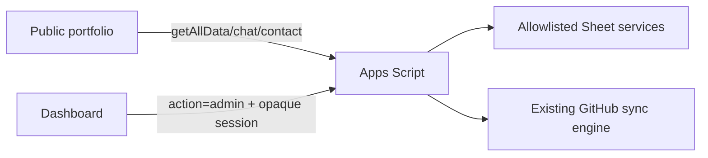

# Master Dashboard Implementation Map

**Baseline:** Apps Script Version 22 and the 18-tab production workbook  
**Dashboard host:** GitHub Pages `/admin/`  
**Admin transport:** form-encoded POST to Apps Script `action=admin`

## Runtime Boundaries

- Public DTOs and public rendering remain unchanged except that future inactive rows are filtered.
- The dashboard never receives a sheet name, cell range, Script Property, password verifier, session digest, GitHub token, demo credential, or private AI value unless requested through the dedicated authenticated private editor.
- GitHub snapshot fields are read-only. Only curation fields may be changed by the dashboard.

## Field Classification

| Storage | Classification | Dashboard capability |
|---|---|---|
| Profile professional allowlist | PUBLIC, PORTFOLIO_OWNED | Read/update |
| Profile sex/age/marital fields | PRIVATE | Not returned or editable |
| Config safe-key registry | PUBLIC, PORTFOLIO_OWNED | Read/update |
| Skills, Experience, Education, Certificates, Blogs, FAQ | PUBLIC, PORTFOLIO_OWNED | CRUD with archive/publication semantics |
| GitHub_Project_Snapshot | GITHUB_OWNED, SYSTEM | Read-only summary |
| Portfolio_Project_Curation | PORTFOLIO_OWNED | Publish, feature, order, and presentation overrides |
| Manual_Portfolio_Projects | PORTFOLIO_OWNED | CRUD/archive |
| Projects | PRIVATE rollback data | No dashboard access |
| AI_Prompt, AI_Knowledge | PRIVATE, ADMIN_ONLY | Authenticated editing only |
| Portfolio_Media, Portfolio_SEO | PORTFOLIO_OWNED | CRUD/archive after setup |
| GitHub_Sync_Status | SYSTEM | Read-only; guarded Sync Now invokes existing engine |
| Admin_Activity_Log | SYSTEM, ADMIN_ONLY | Append-only server writes; bounded reads |
| Visitors, VisitorLog, Submissions | PRIVATE/SYSTEM | Not exposed by this release |
| Script Properties | PRIVATE/SYSTEM | Authentication and sync services only |

## Admin Commands

Authentication: `auth.login`, `auth.session`, `auth.changePassword`, `auth.logout`.

Content: `overview.read`, `profile.read/update`, `config.read/update`, `entity.list/save/archive`, `projects.list`, `projects.github.update`, `projects.manual.save/archive`, `ai.prompt.read/update`.

Operations: `sync.status/run`, `activity.list`.

Unknown commands fail closed. No command accepts arbitrary Sheet or range input.

## Owner Setup Migration

`setupMasterDashboard()` is idempotent and runs only from the authenticated Apps Script owner context. It:

1. reads `ADMIN_BOOTSTRAP_PASSWORD` from Script Properties;
2. stores a salted PBKDF2-HMAC-SHA256 verifier and deletes the bootstrap value;
3. sets forced password change;
4. adds stable IDs and lifecycle/order fields required by the fixed entity definitions;
5. marks existing rows active when an Active field is introduced;
6. creates `Portfolio_Media`, `Portfolio_SEO`, and `Admin_Activity_Log` with fixed schemas;
7. preserves existing rows, formulas, curation, sync data, legacy Projects, and triggers.

The temporary password is absent from source, browser code, Sheets, and logs.

## Module Mapping

| Dashboard module | Backend source |
|---|---|
| Overview | Server-computed counts and sync status |
| Projects | Snapshot + Curation + Manual Projects |
| Profile | Profile professional allowlist |
| Skills | Skills |
| Experience | Experience |
| Education | Education |
| Certificates | Certificates |
| Blog | Blogs |
| FAQ | FAQ |
| Configuration | Config safe-key registry |
| Media | Portfolio_Media |
| SEO | Portfolio_SEO |
| AI / Chat | private AI_Prompt and AI_Knowledge |
| GitHub Sync | GitHub_Sync_Status and existing sync engine |
| Activity Log | Admin_Activity_Log |
| Account / Security | Script Property password/session service |

## Security Controls

- Password verifier only; forced first change and password complexity policy.
- Opaque 256-bit session token held only in page memory; only SHA-256 token digest stored.
- 30-minute idle and 8-hour absolute expiry; password version revokes older sessions.
- Login throttling and constant-time verifier comparison.
- Explicit DTOs and command allowlists.
- HTTPS URL validation, length limits, and spreadsheet-formula neutralization.
- Archive/deactivate defaults; GitHub repositories cannot be deleted.
- Sanitized activity fields; no request bodies or sensitive values in audit entries.
- Existing ScriptLock, last-known-good snapshot, validation, rate-limit, and rollback behavior reused for Sync Now.

## Deployment Sequence

1. Local tests, syntax checks, browser checks, diff and secret scan.
2. Commit and push GitHub Pages dashboard and public Login link.
3. Push Apps Script HEAD, create immutable version, and update existing deployment.
4. Owner sets the one-time bootstrap Script Property and runs `setupMasterDashboard()` once.
5. Verify forced password change and authenticated read modules.
6. Run non-destructive production smoke tests and confirm public regression.

