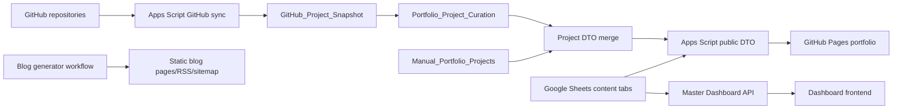
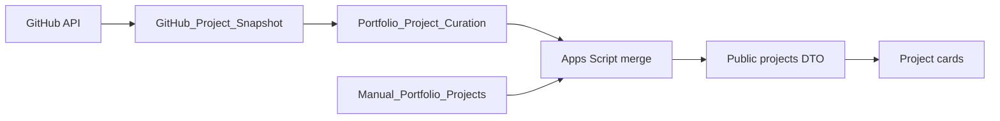

# Master Portfolio System Audit

## 1. Audit Control and Scope

This audit covers the production portfolio repository, GitHub Pages frontend, Google Apps Script API/admin layer, Google Sheets CMS, GitHub synchronization, Dashboard, images, SEO, automation, security, error handling, and maintainability. It was performed read-only against repository revision `f758a890ccb4ad5f66d441ed8d3334fc9464ad59`, Apps Script Version 29, and the current bounded Sheet ranges. No production request was made during this pass because `getAllData` creates a `VisitorLog` row.

Evidence sources included all 127 tracked files, 22 Sheet tabs, GitHub repository metadata, deployment metadata, the previously captured production DTO, prior production headers, 56 automated tests, 14 Playwright tests, dependency audit, and Git status. Three pre-existing untracked verification reports were not modified.

## 2. System Inventory

Production repository topology:

- Static public site: `index.html`, `components/`, `assets/css/`, `assets/js/`, `blog/`, `404.html`.
- Admin UI: `admin/index.html`, `admin/assets/`.
- Apps Script: `apps-script/*.gs`, `apps-script/appsscript.json`.
- Tests: `tests/`, Playwright configuration and captured DTO fixtures.
- Automation: `.github/workflows/publish-blogs.yml` plus blog generator helpers.
- Production data: spreadsheet `Masum_Portfolio_Database`, ID ending `...lWu76iE`, locale `en_GB`, timezone `Asia/Dhaka`.

## 3. Current Data Flow

### Public content

Google Sheets content tabs are read by Apps Script table readers and explicit DTO builders. `getAllData` returns an envelope containing `profile`, `config`, `siteFeatures`, `skills`, `projects`, `experience`, `education`, `certificates`, `blogs`, `faq`, and `aiContext`. The frontend fetches that endpoint, validates the envelope, stores a last-known-good DTO, applies content, then initializes feature visibility, SEO, images, and components.

### Projects

The legacy `Projects` tab is no longer a production source. It remains rollback data. Repository metadata is GitHub-owned; presentation, publication, ordering, copy overrides, image selection, KPI, and highlights are curator-owned.

### Administration

The Dashboard posts allowlisted commands to Apps Script. Authorization, validation, normalization, schema enforcement, and activity logging are server-side. Authentication creates a hashed session stored in Script Properties; the browser keeps only the bearer token in memory.

### Blogs

Blog list data is Sheets/API-driven, but static article pages, RSS, sitemap, and blog index are generator-owned artifacts committed by the GitHub Actions workflow. These paths are not currently one atomic publication pipeline.

## 4. Google Sheets Architecture

Twenty-two tabs were reviewed:

| Tab | Role | State / finding |
|---|---|---|
| Profile | Public identity and biography | One row; strict DTO; contains three unrelated/private hygiene fields. |
| Config | Runtime public configuration | Key/value data; Dashboard-manageable safe keys. |
| Site_Features | Section visibility | 13 unique active features; source of runtime visibility. |
| Skills | Public skills | 8 records; IDs present and unique. |
| Experience | Public experience | 4 records; structured IDs and active state. |
| Education | Public education | 2 records. |
| Certificates | Public certificates | 6 records. |
| Blogs | Blog cards/metadata | 11 records; route generation is separate. |
| FAQ | Public FAQ | 18 active records. |
| Projects | Legacy rollback projects | 4 rows; not consumed by current public builder; includes private demo fields. |
| GitHub_Project_Snapshot | GitHub metadata | 15 unique public active repositories. |
| Portfolio_Project_Curation | GitHub presentation controls | 15 unique repository identities. |
| Manual_Portfolio_Projects | Non-GitHub projects | 3 active published records. |
| GitHub_Sync_Status | Sync health | Latest attempt failed with 403/rate limit; LKG retained. |
| Portfolio_Media | Dashboard media registry | Correct A-column schema; currently empty; not a public consumer. |
| Portfolio_SEO | Dashboard SEO registry | Correct A-column schema; currently empty; not a public consumer. |
| AI_Prompt | Private AI system configuration | Server-only; excluded from public DTO. |
| AI_Knowledge | Reviewed private knowledge | Server-only; 9 identified records. |
| Submissions | Contact PII | Private; two sampled production records. |
| VisitorLog | Current request telemetry | Hashed visitor ID and page; append-on-GET behavior. |
| Visitors | Legacy analytics | Appears unused by current logger; retain pending review. |
| Admin_Activity_Log | Admin audit trail | Value-free change metadata; duplicate adjacent archive actions observed. |

### Integrity assessment

- Snapshot, curation, and public GitHub account all agree on 15 public repositories.
- No private repository appears in the snapshot or public DTO.
- Curation currently publishes `company-hub`, `itsmebillah.github.io`, `Sales_Report_Reminder`, and `Wealth-OS`; three manual projects are also published.
- Record IDs sampled across primary tables were present and unique.
- Media and SEO schema cleanup is complete: headers begin at column A and no production rows exist.
- The Profile tab has columns `sex`, `Age `, and `Maritial status` with inaccurate/unprofessional values. DTO allowlisting prevents public exposure, but the data should be reviewed under controlled approval.

## 5. Apps Script Architecture

The Apps Script layer combines five responsibilities: public content compilation, admin command handling, authentication/session control, GitHub synchronization, and blog/operational automation. The design uses explicit mapping rather than returning Sheet rows directly.

Strengths:

- Strict public DTO allowlists and normalized error envelopes.
- Central command allowlisting and server-side authorization.
- Script Locks around synchronization and mutation-critical paths.
- CacheService for public DTOs and Script Properties for secrets/session/snapshot state.
- Stable IDs, staged GitHub snapshot promotion, verification, rollback, deleted-record retention, and curation preservation.
- Password verifier uses salted PBKDF2-style HMAC-SHA256; sessions use random tokens and hashed server keys.

Constraints:

- The service is a large shared-script boundary: unrelated API, admin, synchronization, and automation faults share Apps Script quotas and deployment lifecycle.
- Public read traffic performs Sheet writes through VisitorLog.
- The complete DTO is cached only below a size threshold; growth can silently remove the main performance protection.
- Direct Apps Script execution-history inspection was unavailable via clasp because no GCP project ID is configured locally.

## 6. GitHub Integration

The account currently has 17 repositories: 15 public and 2 private (`autopilot-pos-saas`, `SignalOps`). All 15 public repositories are represented exactly once in Snapshot and Curation. None is marked archived in current GitHub metadata.

The synchronization implementation filters owner/visibility, retains a last-known-good snapshot, stages writes, verifies identity counts, promotes atomically at the application level, preserves curation, and handles disappearance/archival. Screenshot discovery inspects repository content and may require multiple additional REST calls per repository.

The latest status row is operationally unhealthy:

- Last attempt: `2026-08-09T00:22:19.749Z`
- Last success: `2026-08-08T18:25:50.401Z`
- Status: `failed`
- HTTP: 403
- Code: `GITHUB_RATE_LIMITED`
- Repository count safely retained: 15

This proves failure isolation works, but also proves unauthenticated or insufficiently budgeted discovery is not reliable for a scheduled production system.

## 7. Master Dashboard

The Dashboard provides owner authentication, entity CRUD, project publication controls, feature toggles, media/SEO registries, and activity logs. Its System/Light/Dark theme is tokenized and covered by desktop/mobile Playwright tests. Password validation is consistent across frontend/backend: minimum six characters plus upper, lower, number, and symbol.

Authorization assessment:

- No arbitrary Sheet/range operation is exposed.
- Mutations use command allowlists and server validation.
- Session records enforce idle and absolute expiry and password-version invalidation.
- Tokens remain in memory and logout revokes server state.
- Activity logs record action metadata and changed fields, not values or credentials.

Completeness gaps:

- Media and SEO CRUD currently manage registries that the public API/site does not consume.
- Blog editing changes API list data but does not automatically publish/regenerate static routes.
- No strong evidence of search, preview, bulk actions, undo, or publication-job status.
- Expired sessions surface errors, but automatic return to the login state should be verified/improved.

## 8. Public Frontend

The homepage is componentized and data-applied at runtime. Captured-DTO tests validate dynamic content, seven project cards, feature hiding, theme behavior, mobile navigation, and image fallbacks. The page is accessible on desktop and mobile sizes without test-detected horizontal overflow.

The static initial HTML contains intentional crawler/accessibility fallbacks, but personal data and SEO are also repeated in `assets/js/seo.js` and blog generator helpers. Current Sheet title and generator homepage title already differ, demonstrating drift.

Section visibility hides mapped sections and navigation at runtime. However, SEO is built from unfiltered payload data before/without the same visibility policy, so disabled content may remain represented in structured data or meta fallbacks.

## 9. Theme and Responsive Audit

Homepage and Dashboard support System, Light, and Dark themes with persisted manual selection and instant switching. The automated matrix passed System Light, System Dark, Manual Light, Manual Dark, refresh persistence, desktop, mobile, Android Chrome emulation, and installed Brave where available.

Theme scope is incomplete across the full public website: generated blog pages and `404.html` use hard-coded dark styling and do not share the public theme controller. Therefore the theme system is robust within its two primary applications but not universal across every public route.

## 10. Image Pipeline

Profile flow: Profile Sheet `ProfilePic` -> strict profile DTO -> frontend content state -> hero image component -> retry/fallback initials. Project flow: Snapshot screenshot + Curation manual override -> merge DTO -> project component -> fallback.

Working controls:

- Manual image overrides remain authoritative.
- GitHub discovery is optional.
- Missing project images fall back without breaking card layout.
- Automated desktop/mobile tests cover manual, discovered, and fallback cases.

Outstanding reliability issue:

- The profile image is served from a third party with an observed `Cache-Control` lifetime of roughly ten years. Desktop and mobile received identical API URLs and bytes in the prior controlled investigation, yet real Android Chrome/Brave still showed initials. Exact-URL retries do not bypass a poisoned/stale browser cache. The durable fix is a versioned first-party asset (preferred) or an explicit content-version query combined with client DTO-cache invalidation.

## 11. SEO and Discoverability

The repository includes canonical/meta/structured-data runtime logic, static HTML fallbacks, sitemap, robots, RSS, blog metadata generators, and Open Graph imagery. These are useful foundations.

Risks:

- Branding/title/contact/skill defaults exist in several sources and can drift.
- Feature visibility is not consistently applied to structured data.
- Dashboard SEO records are not public consumers.
- Static blog routes require generator execution after content changes.
- CSS/cache versioning is inconsistent on preload, blog, and error routes.

## 12. Security and Privacy

Security controls are materially sound for a personal portfolio CMS:

- Public output is DTO-allowlisted; private prompt, private knowledge, demo credentials, internal Sheet fields, and blank headers are excluded.
- Secrets are retrieved from Script Properties, not committed source.
- Password storage is salted and iterative; plaintext bootstrap password is deleted after successful setup.
- Sessions are randomized, server-hashed, revocable, time-bounded, and password-version-bound.
- Login, chat, and contact endpoints have explicit rate limits.
- Admin mutations are allowlisted and audited.
- Dependency audit found zero known vulnerabilities.

Review items:

- The approved six-character password minimum is weaker than current high-value admin best practice; hashing/session security is unchanged, but a longer passphrase policy is recommended later.
- The PBKDF2-style iteration count of 20,000 should be benchmarked and increased under a versioned verifier migration.
- Public email and phone are intentionally exposed and attract scraping/spam.
- `aiContext` remains a compatibility key in the public envelope while the referenced legacy sheet is absent; confirm whether it should remain public.
- Third-party CDN scripts/styles increase supply-chain and CSP complexity. Tailwind's browser CDN is particularly unsuitable as a long-term production dependency.
- No source secret was identified by tests/targeted review. Production Script Properties were not read or exposed.

## 13. Performance and Caching

Positive controls include static hosting, server DTO caching, lazy/deferred image behavior, versioned homepage assets, and client last-known-good recovery.

Risks:

- Client DTO cache has schema validation but no meaningful freshness expiry, so a prolonged API outage can display indefinitely stale data.
- VisitorLog makes every cacheable read also a write, consuming Sheet quotas and latency.
- When serialized DTO exceeds the server cache threshold, caching is skipped rather than partitioned.
- GitHub screenshot discovery amplifies API calls.
- Tailwind browser CDN and multiple external resources add network and supply-chain costs.
- The stylesheet preload URL is unversioned while the applied homepage stylesheet is versioned; blog/error assets are also inconsistently versioned.

## 14. Automation and Deployment

GitHub Pages deploys the static repository. The blog workflow supports manual and repository-dispatch generation, validates slugs, and commits generated outputs with `contents: write`. Apps Script production is an immutable deployment at Version 29; the previously verified anonymous endpoint and current GitHub Pages build match the audited release line.

Operational gaps:

- Apps Script execution history cannot be queried from the local clasp setup because its GCP project ID is unset.
- The sync status proves the scheduled path can fail under rate limiting; alerting/retry timing is insufficiently visible.
- Dashboard blog mutation and GitHub blog publication are separate actions.
- A workflow that commits directly needs branch-protection/concurrency/failure-notification review.

## 15. Failure and Recovery Matrix

| Failure | Current behavior | Residual risk |
|---|---|---|
| Apps Script/API unavailable | Frontend uses cached DTO/fallback | Cache can become indefinitely stale. |
| Sheets read/schema failure | Compilation fails safely; prior frontend state survives | Public request logging may also fail/consume quota. |
| GitHub rate limit | Sync aborts; LKG snapshot remains | Metadata becomes stale; retry/alerting weak. |
| Sync partial write | Staging/verification/promotion/rollback | Must retain tests as schema grows. |
| Image unavailable | Retry then initials/project fallback | Same-URL retry cannot evade stale mobile cache. |
| AI provider failure | Sanitized failure/fallback | Controlled production behavior should remain monitored. |
| Session expiry | Server rejects request | Dashboard re-login UX can be clearer. |
| Blog generation failure | Existing static pages remain | API cards and routes can diverge. |

## 16. Data-Driven Completeness Matrix

| Domain | Source of truth | Publicly dynamic | Dashboard manageable | Assessment |
|---|---|---:|---:|---|
| Profile/about/contact/social | Sheets | Yes | Yes | Good; static fallbacks duplicated. |
| Skills/experience/education/certificates/FAQ | Sheets | Yes | Yes | Good. |
| Feature visibility | Site_Features | Yes | Yes | Good runtime control; SEO mismatch. |
| GitHub projects | Snapshot + Curation | Yes | Yes | Good design; sync health issue. |
| Manual projects | Manual sheet | Yes | Yes | Good. |
| Project/media assets | Curation/manual URLs | Yes | Partial | Registry is not wired. |
| SEO | HTML/runtime generator | Partial | Registry only | Not end-to-end dynamic. |
| Blog cards | Sheets | Yes | Yes | Good. |
| Static blog routes/RSS/sitemap | GitHub generator | Build-time | No atomic Dashboard publish | Split source/process. |
| AI prompt/knowledge | Private Sheets | Server-side | Yes | Correctly private. |

## 17. Legacy, Duplicate, and Dead-Code Review

| Candidate | Evidence | Recommendation |
|---|---|---|
| Legacy `Projects` tab | Current project builder uses GitHub/manual layers | Keep for rollback; review demo credential retention. |
| `Visitors` tab | Current logger writes `VisitorLog` | Review consumers and retention before archiving. |
| Legacy `AI_CONTEXT` reference | No matching tab in spreadsheet inventory | Preserve envelope compatibility; remove only via versioned API change. |
| `Table_creation.js` | Migration/bootstrap seed logic and old profile defaults | Mark migration-only; do not execute/remove without dependency review. |
| Compatibility helpers | Some wrappers/parsers appear unreferenced | Confirm via call graph and clasp/runtime entrypoints before removal. |
| Identity/SEO constants | Repeated in HTML, SEO JS, and generator helpers | Replace with generated canonical config, retaining safe static fallback. |

## 18. Findings Register

### P0 - Critical

No P0 issue was found.

### P1 - High

**AUD-001 - Scheduled GitHub synchronization is not currently reliable**  
Evidence: `GitHub_Sync_Status` records 403 `GITHUB_RATE_LIMITED`; last success predates last attempt.  
Impact: repository metadata/screenshots can become stale.  
Recommendation: use a scoped GitHub token, reduce/batch screenshot discovery, honor reset/ETag state, add failure notification, then perform exactly one controlled sync.  
Change risk: Medium. Effort: Medium.

**AUD-002 - Android profile-image delivery remains unreliable**  
Evidence: real Android shows the initials fallback while desktop works; third-party response had an exceptionally long cache lifetime.  
Impact: the first-viewport personal brand appears broken for mobile visitors.  
Recommendation: version and self-host the profile image; invalidate client DTO cache by build/content version.  
Change risk: Low. Effort: Low.

**AUD-003 - Media and SEO Dashboard modules do not control production output**  
Evidence: both tabs are empty and no corresponding public DTO/site consumer is present.  
Impact: owner actions can appear successful without affecting the portfolio.  
Recommendation: define explicit read models, precedence, preview, validation, and frontend consumption before enabling production use.  
Change risk: Medium. Effort: Medium/High.

**AUD-004 - Blog publication is split across Sheets and GitHub generation**  
Evidence: Dashboard CRUD changes API data; `.github/workflows/publish-blogs.yml` separately commits static pages/RSS/sitemap.  
Impact: cards, routes, RSS, sitemap, and SEO may diverge.  
Recommendation: introduce a controlled publication job/status workflow or make route generation the authoritative publish operation.  
Change risk: Medium. Effort: Medium.

**AUD-005 - Public data reads mutate production telemetry**  
Evidence: `getAllData` appends VisitorLog; prior one-request verification created exactly one row.  
Impact: quota exhaustion, latency, audit ambiguity, and inability to verify read-only safely.  
Recommendation: decouple telemetry into a sampled/buffered endpoint or client analytics system with retention policy.  
Change risk: Medium. Effort: Medium.

**AUD-006 - Canonical branding and SEO are duplicated**  
Evidence: values recur in `index.html`, `assets/js/seo.js`, and `blog/generator/*`; current Sheet and generator titles differ.  
Impact: recruiter-visible identity, titles, skills, links, and structured data drift.  
Recommendation: generate static SEO fallbacks from one reviewed configuration at build time.  
Change risk: Medium. Effort: Medium.

### P2 - Medium

**AUD-007 - Client DTO cache has no bounded staleness policy.** Add fetched-at/content-version TTL and transparent refresh. Risk Low; effort Low/Medium.

**AUD-008 - Feature visibility is not consistently applied to SEO/structured data.** Filter SEO graph by active features or explicitly document crawler policy. Risk Medium; effort Medium.

**AUD-009 - Theme coverage excludes blog/error routes.** Reuse centralized tokens/controller without redesigning page composition. Risk Low; effort Medium.

**AUD-010 - Password cost/policy is below preferred admin baseline.** Plan versioned verifier migration to longer passphrases and benchmarked cost; do not alter hashing/session design casually. Risk Medium; effort Medium.

**AUD-011 - External production dependencies are insufficiently controlled.** Replace Tailwind browser CDN with compiled CSS and add CSP/SRI/allowlist strategy. Risk Medium; effort Medium.

**AUD-012 - Profile Sheet contains inaccurate private hygiene fields.** Review and remove/correct only with approval; allowlist already prevents exposure. Risk Low; effort Low.

**AUD-013 - Asset cache versioning is inconsistent.** Version preload, blog, error, and generated-page assets uniformly. Risk Low; effort Low.

**AUD-014 - Apps Script operational observability is incomplete.** Configure a safe GCP project/logging path and alerts without exposing secrets. Risk Low; effort Medium.

**AUD-015 - Dashboard expired-session recovery needs explicit UX verification.** Route authorization expiry cleanly to login while preserving unsaved-form warnings. Risk Low; effort Low.

**AUD-016 - Public `aiContext` compatibility output needs ownership review.** Confirm intended semantics and retain/removal plan; never expose prompt/knowledge. Risk Medium; effort Low.

### P3 - Low / Enhancement

**AUD-017 - Dashboard productivity controls are limited.** Add search/filter, preview, bulk operations, and clear publish state after P1 work. Risk Low; effort Medium.

**AUD-018 - Activity log can contain repeated adjacent actions.** Add correlation/idempotency IDs or clearer repeated-action display. Risk Low; effort Low.

**AUD-019 - Legacy tabs/utilities need formal retention labels.** Document owner, last use, rollback window, and removal criteria. Risk Low; effort Low.

## 19. Validation Results

| Validation | Result |
|---|---|
| Repository/source inventory | 127 tracked files reviewed by category |
| Sheet inventory | 22/22 tabs and bounded headers/data reviewed |
| Unit/integration suite | 56/56 passed |
| Captured-DTO Playwright suite | 14/14 passed |
| Dependency vulnerability audit | 0 known vulnerabilities |
| JavaScript syntax/test checks | Passed through suite |
| Desktop/mobile/theme/image matrix | Passed automated captured-DTO tests |
| Public contract baseline | Prior controlled production request: HTTP 200, valid v1 envelope |
| GitHub Pages baseline | Latest audited release: build `20260809.4`, revision `f758a89` |
| Apps Script deployment baseline | Production Version 29 |
| New production mutations during audit | None |

There is no configured lint, typecheck, or compilation build script; this is a static frontend. A final live execution-history query was not possible through clasp because the local project has no GCP project ID. A final shell-based GitHub run refresh was also blocked by a Windows process-launch error; existing authoritative release evidence was used and no unsafe workaround was attempted.

## 20. Controlled Production Tests Required

| Test | Why controlled | Acceptance criteria |
|---|---|---|
| Feature toggle | Mutates `Site_Features` and cache | Toggle one noncritical section off/on; API, nav, section, SEO, log, and restoration verified. |
| Contact pipeline | Creates PII/submission and may email | Exactly one approved synthetic submission; row, email, rate limit, and cleanup policy verified. |
| GitHub sync | Writes staging/snapshot/status and uses API quota | Authenticate first; exactly one run; 15-repo identity and curation preservation verified. |
| Scheduled execution history | Owner/log access required | Confirm post-fix trigger run, timestamp, success, and next schedule. |
| Android image | Real-device cache behavior | First-party versioned profile image renders on Chrome/Brave normal and desktop modes. |

## 21. Prioritized Roadmap

### P1 - Stabilize production contracts

1. Authenticate and optimize GitHub synchronization; add operational alerts.
2. Move profile image to versioned first-party delivery and version the DTO cache.
3. Decouple VisitorLog writes from `getAllData`.
4. Specify and implement end-to-end Media and SEO ownership.
5. Unify Dashboard blog edits with static route/RSS/sitemap publication.
6. Generate static identity/SEO fallbacks from one reviewed source.

### P2 - Consistency and hardening

1. Apply visibility policy to SEO and structured data.
2. Extend tokens/theme behavior to blog and error routes.
3. Compile CSS locally; add CSP/SRI strategy and consistent cache versioning.
4. Add bounded client-cache freshness and partitioned server caching.
5. Improve execution monitoring, session-expiry UX, and data-retention documentation.
6. Plan a versioned password-verifier cost/policy upgrade.

### P3 - Owner productivity

1. Add Dashboard search, filters, previews, bulk operations, and publication job status.
2. Improve activity-log correlation and exports.
3. Retire confirmed legacy tables/functions only after an approved dependency and rollback review.

## 22. Recommended Source of Truth

| Data | Canonical owner |
|---|---|
| Personal bio/contact/social | Google Sheets Profile/Config |
| Skills, career, education, certificates, FAQ | Google Sheets domain tabs |
| Repository facts | GitHub, mirrored to Snapshot |
| Portfolio project curation | Curation/Manual project tabs |
| Repository documentation/screenshots | GitHub repository assets, with curator override |
| Profile/manual/certificate media | Curated first-party media registry |
| Runtime feature visibility | Site_Features |
| Private AI behavior | AI_Prompt + AI_Knowledge, server-only |
| SEO/editorial overrides | Portfolio_SEO after a defined DTO/build contract |
| Blog article source and publish state | One explicit publication workflow, not two implicit paths |

## 23. What Must Remain Manual

- Project publication, featured state, ordering, editorial titles/descriptions, KPI/highlights, and manual images.
- Profile image choice and other non-GitHub media.
- Private AI prompt/knowledge approval.
- Contact PII review and retention decisions.
- Final editorial/SEO approval and rollback decisions.

## 24. What Can Be Automated Safely

- Authenticated repository metadata refresh with rate-budget controls.
- Screenshot candidate discovery, never overriding a configured manual image.
- Generated static SEO fallbacks, sitemap, RSS, and blog routes from approved source data.
- Schema/ID/URL/DTO validation before publication.
- Deployment smoke tests, broken-link checks, responsive screenshots, and alerts.
- Snapshot retention and rollback verification.

## 25. What Not to Change Yet

- Do not delete legacy Projects/Visitors data, old migration utilities, or compatibility keys.
- Do not rewrite Apps Script deployment history or Git history.
- Do not modify project curation, manual images, featured/order state, or private repository visibility.
- Do not install/run another sync until authentication/rate-budget remediation is approved.
- Do not expose secrets or private AI/Sheet fields to simplify frontend access.
- Do not activate empty Media/SEO controls as authoritative before their public contract exists.

## 26. Hiring-Manager Review

The public portfolio presents a strong data/automation engineering profile: real systems, consistent project cards, a functional admin layer, responsive behavior, and evidence of testing and operational thought. The highest visible weakness is image reliability on mobile. The highest credibility risks behind the interface are stale GitHub data, split blog publication, and duplicated identity/SEO claims. Resolving the P1 list would move the system from a polished personal project to a more convincingly operated portfolio platform.

## 27. Final Assessment

**Overall score: 78/100**  
**Release posture: READY WITH RECOMMENDATIONS**

The current release can remain live. No evidence supports rollback. P1 remediation should precede expansion of Dashboard modules or additional automation. The security boundary and last-known-good behavior are strong enough to support controlled improvements without redesign.

## 28. Final Status

**MASTER_AUDIT_COMPLETE**
