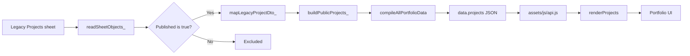
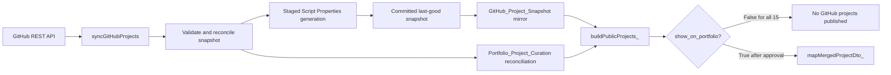
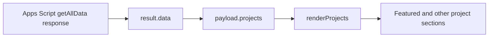
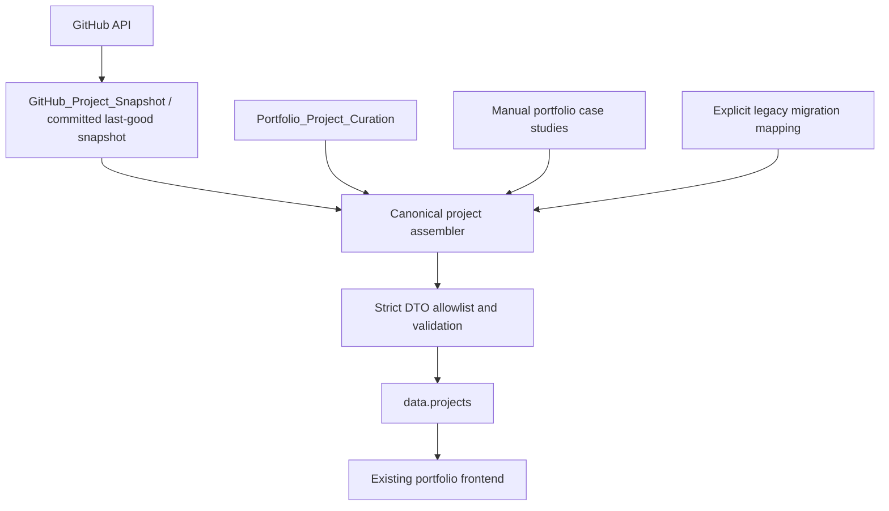

# Project Data Flow Audit

**Account:** `itsmebillah`  
**System:** Portfolio frontend, Google Apps Script, Google Sheets, GitHub synchronization  
**Audit date:** 2026-08-08  
**Mode:** Read-only architecture audit

## Executive Summary

The live portfolio is behaving consistently with the current Version 19 implementation. The frontend already consumes the canonical `data.projects` array and supports the modern GitHub-backed DTO. Apps Script also already invokes the GitHub/curation merge builder. However, all 15 repository curation rows currently have `show_on_portfolio = false`, so no GitHub-backed project passes the publication gate. Apps Script therefore returns the four published rows from the legacy `Projects` sheet as a compatibility fallback.

The new GitHub project layer must not replace the legacy source wholesale yet. Three of the four legacy portfolio projects have no reliable GitHub repository match, and an immediate replacement would remove them from the public portfolio. `Wealth OS` has a strong GitHub match, but the sync does not currently associate the legacy row with that immutable repository ID.

The safest architecture is a canonical Apps Script merge over two explicitly managed project types:

1. GitHub-backed projects, joined by immutable `github_repository_id` to `Portfolio_Project_Curation`.
2. Manual case studies for work that has no public GitHub repository.

Migration from the legacy sheet should use an explicit mapping key. It should not depend on project-name matching.

## Scope And Safety

This audit inspected the deployed data model and the corresponding local Version 19 source. It did not:

- modify Google Sheets data;
- change the public API;
- publish any repository;
- change `show_on_portfolio` or `featured`;
- install or modify a trigger;
- run another GitHub synchronization;
- modify the portfolio application.

Only this audit document was created.

## 1. Current Source Of `data.projects`

The public response is assembled by `compileAllPortfolioData()` in `apps-script/Code.js`. It opens the configured portfolio spreadsheet and assigns:

```javascript
projects: buildPublicProjects_(ss)
```

The builder does not read only one sheet. It currently combines:

- the last-good GitHub snapshot;
- `Portfolio_Project_Curation`;
- the legacy `Projects` sheet.

In the current production state, the effective source of all four public entries is the legacy `Projects` sheet because none of the GitHub curation rows passes the publication gate.

## 2. Current Legacy Flow



Exact implementation path:

1. `compileAllPortfolioData()` calls `buildPublicProjects_(ss)`.
2. `buildPublicProjects_()` reads `MASTER_CONFIG.tabs.projects`, configured as `Projects`.
3. Rows are retained only when `Published` normalizes to true.
4. `mapLegacyProjectDto_()` converts each row to the strict public project shape.
5. The result is returned as `data.projects`.
6. `assets/js/api.js` passes `payload.projects` to `renderProjects()`.
7. `assets/modules/projects.js` renders modern camelCase fields and retains legacy-name fallbacks for compatibility.

### Legacy Sheet Schema

The current `Projects` headers are:

`Name`, `Category`, `Description`, `ProblemSolved`, `Impact`, `TechStack`, `Image`, `Tags`, `LiveURL`, `GitHubURL`, `Featured`, `DemoEmail`, `DemoPassword`, `Published`

The public legacy mapper returns only an allowlisted DTO. It does not expose `DemoEmail` or `DemoPassword`.

### Currently Published Legacy Projects

| Legacy project | Published | GitHub URL evidence | Repository match |
|---|---:|---|---|
| Autopilot Business System | Yes | Blank | No reliable match found |
| Car Sales Analysis | Yes | Blank | No reliable match found |
| HR Analytics Dashboard | Yes | Blank | No reliable match found |
| Wealth OS | Yes | Non-identifying value: `github.com` | Strong match: `itsmebillah/Wealth-OS`, ID `1268515486` |

## 3. Function Building The Public Projects DTO

`buildPublicProjects_(ss)` in `apps-script/GitHubSync.js` is the canonical builder.

Its current sequence is:

1. Load the last-good GitHub repository snapshot.
2. Read `Portfolio_Project_Curation` and index rows by `github_repository_id`.
3. Keep only active, public, enabled repositories.
4. Require a matching curation row with `show_on_portfolio = true`.
5. Restrict archived repositories to reviewed `completed` or `historical` status.
6. Convert eligible repositories with `mapMergedProjectDto_()`.
7. Read published legacy projects.
8. Suppress a legacy row only when its normalized `Name` equals the `name` of an already published GitHub-backed project.
9. Convert remaining legacy rows with `mapLegacyProjectDto_()`.
10. Concatenate and sort the two result sets.

This confirms that the merge layer is already on the production response path. It currently yields zero GitHub-backed entries because all 15 curation rows are unpublished.

## 4. New GitHub Flow



### Snapshot Storage

The synchronized repository data is stored in two coordinated forms:

- A staged and committed last-good snapshot in Apps Script Properties. `loadLastGoodSnapshot_()` prefers this committed generation.
- A spreadsheet mirror in `GitHub_Project_Snapshot`, used as a fallback and for review.

The snapshot contains 15 active public repositories and uses immutable `github_repository_id` as its primary identity. Its fields are:

`github_repository_id`, `github_node_id`, `repo_key`, `name`, `description`, `repository_url`, `homepage_url`, `topics_json`, `primary_language`, `visibility`, `archived`, `disabled`, `license_spdx`, `stars`, `forks`, `default_branch`, `created_at`, `updated_at`, `pushed_at`, `readme_url`, `fetched_at`, `source_etag`, `sync_state`, `last_seen_at`, `missing_since`

### Curation Storage

Editorial and publication decisions are stored in `Portfolio_Project_Curation`:

`github_repository_id`, `repo_key`, `show_on_portfolio`, `featured`, `display_order`, `section`, `category`, `custom_title`, `custom_description`, `portfolio_image`, `tech_stack_override`, `demo_url_override`, `kpi_highlight`, `portfolio_status`, `visibility_note`, `last_reviewed_at`

There are 15 repository-linked curation rows. All currently have:

- `show_on_portfolio = false`;
- `featured = false`;
- no reviewed editorial overrides.

A pre-existing blank checkbox/validation row has no repository ID and does not participate in the merge.

## 5. Existing Project-To-GitHub Mapping

### Do The Four Legacy Rows Store GitHub IDs?

No. The legacy `Projects` schema has neither `github_repository_id` nor `repo_key`. Its optional `GitHubURL` cannot provide immutable identity, and three rows have no repository URL at all.

### Match Assessment

| Legacy project | Match confidence | Evidence | Safe action |
|---|---|---|---|
| Wealth OS | High | Normalized name match and exact live homepage match to `itsmebillah/Wealth-OS`; snapshot ID `1268515486` | Approve an explicit immutable-ID migration later |
| Autopilot Business System | None | No repository URL and no unambiguous snapshot repository | Retain as a manual case study |
| Car Sales Analysis | None | No repository URL and no unambiguous snapshot repository | Retain as a manual case study |
| HR Analytics Dashboard | None | No repository URL and no unambiguous snapshot repository | Retain as a manual case study |

No fuzzy association should be created for the unmatched projects. A title, topic, or technology similarity is insufficient evidence of repository ownership.

### Does The Current Sync Map Legacy Projects?

No. The synchronization process creates or reconciles curation rows for GitHub repositories by immutable repository ID. It does not update the legacy `Projects` rows, import their editorial fields, or associate them with repository IDs.

The current public builder has only a display-time duplicate guard based on a case-insensitive name comparison. That guard runs after a GitHub project is explicitly published. It is not a persistent mapping and is unsafe as the long-term migration mechanism because titles can be renamed or overridden.

## 6. Data Ownership In The Current Merged DTO

### GitHub-Owned Fields

The following should come from `GitHub_Project_Snapshot` for repository-backed entries:

| Public concern | Snapshot source |
|---|---|
| Stable identity | `github_repository_id` |
| Repository key/name | `repo_key`, `name` |
| Repository URL | `repository_url` |
| Base description | `description` |
| Base demo URL | `homepage_url` |
| Topics | `topics_json` |
| Primary language | `primary_language` |
| Repository state | `visibility`, `archived`, `disabled`, `sync_state` |
| Documentation link | `readme_url` |
| Last update | `updated_at` |

### Google Sheets/Curation-Owned Fields

The following should remain deliberate editorial controls:

| Public concern | Curation source |
|---|---|
| Publication | `show_on_portfolio` |
| Featured status | `featured` |
| Ordering | `display_order` |
| Portfolio grouping | `section`, `category` |
| Display title | `custom_title` |
| Display description | `custom_description` |
| Project image | `portfolio_image` |
| Stack presentation | `tech_stack_override` |
| Demo exception | `demo_url_override` |
| KPI/highlight | `kpi_highlight` |
| Portfolio lifecycle status | `portfolio_status` |

This ownership split is already substantially implemented by `mapMergedProjectDto_()`.

## 7. Frontend Consumption

The frontend does not read Google Sheets or GitHub directly. It consumes the Apps Script response:



`renderProjects()` already understands the modern fields `title`, `description`, `image`, `techStack`, `demoUrl`, `url`, `featured`, and `displayOrder`. It also falls back to legacy field names. No frontend redesign is required to display a correctly curated merged DTO.

## 8. Can The New Layer Safely Replace Or Merge The Legacy Source?

### Replace Now: No

A wholesale replacement is unsafe because:

- all 15 GitHub curation rows are intentionally unpublished;
- it would reduce the public project list from four to zero;
- three legacy projects have no reliable GitHub repository equivalent;
- legacy editorial content has not been reviewed or migrated;
- the current duplicate guard relies on mutable names rather than an explicit migration identity.

### Merge After Controlled Curation: Yes

The existing builder is a useful transition mechanism, but it needs an explicit migration relationship before legacy entries are retired. GitHub-backed and non-GitHub case studies should coexist in one canonical public DTO.

## 9. Recommended Merge Architecture



### Recommended Model

1. Keep GitHub technical metadata read-only and keyed by `github_repository_id`.
2. Keep publication and editorial presentation in `Portfolio_Project_Curation`.
3. Add an explicit migration reference, such as `legacy_project_key`, or a separate migration mapping table. Do not infer it from a display title.
4. Represent non-GitHub work as manual case studies with stable IDs such as `case-study:car-sales-analysis`.
5. Produce one strict canonical project DTO in Apps Script for both project types.
6. Exclude a legacy row only after an explicit mapping is approved and the replacement passes parity checks.
7. Retain the existing frontend contract; no visual redesign is necessary for this migration.

### Recommended Migration Sequence

1. Define stable IDs for the four legacy rows without changing publication state.
2. Approve `Wealth OS` -> GitHub repository ID `1268515486` as the first explicit mapping.
3. Review which Wealth OS values remain editorial: image, featured state, order, category, custom copy, and KPI.
4. Keep the other three rows as manual case studies unless authoritative repository matches are supplied.
5. Preview the merged DTO in a non-production verification path.
6. Compare count, titles, URLs, images, featured grouping, ordering, and highlights against production.
7. Publish the mapped GitHub record and retire its legacy counterpart atomically.
8. Migrate additional GitHub repositories only through deliberate curation review.
9. Remove the name-based duplicate rule after all mappings use stable identifiers.

## 10. Required Controls Before Implementation

- Do not auto-enable `show_on_portfolio` during synchronization.
- Do not copy repository descriptions over reviewed custom descriptions.
- Do not treat missing GitHub repositories as deletion instructions for manual case studies.
- Validate all public URLs and image URLs before DTO output.
- Continue using strict field allowlists so snapshot internals and Sheet-only fields remain private.
- Preserve the last-known-good snapshot and legacy fallback until the merged output is verified.
- Make migration idempotent and keyed by immutable repository ID.
- Record mapping decisions explicitly so repository renames do not break associations.
- Preserve rollback by leaving the legacy rows unchanged until replacement verification succeeds.

## 11. Direct Answers

1. **Which tab currently supplies `data.projects`?** `buildPublicProjects_()` reads both the GitHub/curation layer and `Projects`; in the current state, all four returned rows come from `Projects`.
2. **Which function builds the DTO?** `buildPublicProjects_(ss)`, using `mapMergedProjectDto_()` and `mapLegacyProjectDto_()`.
3. **Where is the snapshot?** In the committed last-good Apps Script Properties generation, mirrored in `GitHub_Project_Snapshot` and used from the sheet as fallback.
4. **Where is curation?** `Portfolio_Project_Curation`.
5. **Do the four existing projects have GitHub IDs?** Not in the legacy source. Only Wealth OS has a strong external match to ID `1268515486`.
6. **Does sync already map the four legacy rows?** No. It creates independent repository curation rows and performs no legacy migration.
7. **Can the GitHub layer replace/merge safely?** It can merge safely after explicit curation and stable-ID migration. It cannot safely replace the legacy source wholesale now.

## Final Audit Verdict

**MERGE_FEASIBLE_AFTER_EXPLICIT_CURATION_AND_MAPPING**

The current production output should remain unchanged until the mapping model and migration sequence are approved. No implementation was performed as part of this audit.
