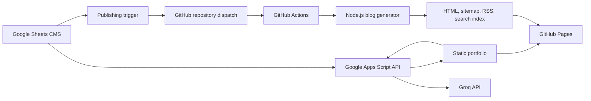

# Md. Masum Billah - Portfolio

Production portfolio for a data analyst and automation developer building dashboards, analytical systems, and workflow automation.


[](https://itsmebillah.github.io/)
[](docs/DEPLOYMENT.md)
[](#technology-stack)
[](docs/ARCHITECTURE.md)

[Live Portfolio](https://itsmebillah.github.io/) | [Blog](https://itsmebillah.github.io/blog/) | [Architecture](docs/ARCHITECTURE.md) | [Deployment](docs/DEPLOYMENT.md) | [Roadmap](docs/ROADMAP.md)

## Overview

This repository powers the public portfolio of **Md. Masum Billah**, a **Data Analyst, Automation Developer, and Business Intelligence Specialist**. The site presents verified projects, skills, experience, certificates, case studies, technical writing, and contact paths in one recruiter-facing experience.

Portfolio content is managed through Google Sheets and served by Google Apps Script. Blog articles are generated as static HTML, validated, committed by GitHub Actions, and published through GitHub Pages. The portfolio assistant routes questions through Apps Script to Groq without exposing the AI credential to the browser.

## Features

- Responsive portfolio with profile, skills, projects, certificates, experience, and contact sections
- Data and automation project case studies with direct repository and demo links
- Static technical blog with category filtering, search indexing, RSS, and sitemap generation
- Google Sheets-backed content management through Google Apps Script
- Automated blog publishing through `repository_dispatch` and GitHub Actions
- Portfolio assistant grounded in structured portfolio context
- Search, SEO metadata, structured data, robots rules, and a custom 404 page
- Modular HTML components and browser JavaScript modules without a frontend build dependency

## Screenshot


The screenshot contains portfolio content from the connected CMS at the time it was captured. The live site remains the canonical source for current experience, skills, and project details.

## Architecture



Read [docs/PROJECT_OVERVIEW.md](docs/PROJECT_OVERVIEW.md), [docs/ARCHITECTURE.md](docs/ARCHITECTURE.md), and [docs/DECISIONS.md](docs/DECISIONS.md) for system boundaries and rationale.

## Technology Stack

| Layer | Technology |
| --- | --- |
| Frontend | HTML, CSS, vanilla JavaScript |
| UI | Tailwind CDN, AOS, particles.js, Google Fonts |
| Content management | Google Sheets, Google Docs, Google Apps Script |
| AI assistant | Groq Chat Completions through Apps Script |
| Static generation | Node.js built-in modules and native `fetch` |
| Automation | GitHub Actions, Apps Script triggers |
| Hosting | GitHub Pages |

## Repository Structure

```text
components/           HTML sections loaded by the homepage shell
assets/css/           Global, component, and animation styles
assets/js/            Startup, API, SEO, search, and shared utilities
assets/modules/       Section-specific renderers and interactions
assets/screenshots/   Curated portfolio captures
assets/social-preview/Repository and Open Graph preview artwork
apps-script/          CMS API, contact/chat handlers, and publishing triggers
blog/generator/       Static blog, sitemap, RSS, and search-index generators
blog/templates/       Canonical article and index templates
docs/                 Architecture, security, deployment, roadmap, and decisions
```

## Local Development

The site must be served over HTTP because browser components are loaded with `fetch`.

```powershell
git clone https://github.com/itsmebillah/itsmebillah.github.io.git
Set-Location itsmebillah.github.io
npx serve .
```

Open the local URL printed by the server. Runtime portfolio content still depends on the configured public Apps Script endpoint in `assets/js/config.js`.

## Blog Generation

```powershell
node blog/generator/blog-page-generator.js
```

Review generated changes in the blog manifest/pages, `sitemap.xml`, `rss.xml`, and `search-index.json`. Do not hand-edit generated article files when the source belongs in the CMS or template.

## Deployment

Frontend commits to `main` are published through the repository's GitHub Pages setting. Apps Script changes require `clasp push` and an update to the existing versioned web-app deployment. Blog publishing can run manually through Actions or through the configured `publish-blogs` repository dispatch.

Follow [docs/DEPLOYMENT.md](docs/DEPLOYMENT.md) for the complete checklist and rollback process.

## Known Limitations

- Homepage content depends on the availability and response shape of the external Apps Script CMS.
- An automated browser capture on 2026-07-29 observed the loader failing to resolve consistently; production API availability should be monitored.
- Repository evidence cannot confirm the active GitHub Pages source, Apps Script version, installed triggers, or Script Properties.
- The frontend has no automated browser regression suite.
- Generated blog artifacts must remain synchronized with their manifest, sitemap, RSS feed, and search index.

## Contributing and Security

Read [docs/CONTRIBUTING.md](docs/CONTRIBUTING.md), [docs/SECURITY.md](docs/SECURITY.md), and [docs/PROJECT_RULES.md](PROJECT_RULES.md) before changing source or generated artifacts. Never commit Apps Script tokens, Groq keys, GitHub tokens, contact submissions, or private spreadsheet exports.

## License

No open-source license is currently declared. The source is publicly visible, but reuse rights are not granted until a license is added by the repository owner.

---

**Md. Masum Billah** | Data Analyst, Automation Developer, and Business Intelligence Specialist

[Portfolio](https://itsmebillah.github.io/) | [GitHub](https://github.com/itsmebillah) | [Email](mailto:itsmbillah@gmail.com) | [LinkedIn](https://www.linkedin.com/in/itsmebillah/) | [Documentation](docs/PROJECT_OVERVIEW.md) | [Related: Sales Intelligence Platform](https://github.com/itsmebillah/Sales-Dashboard)
