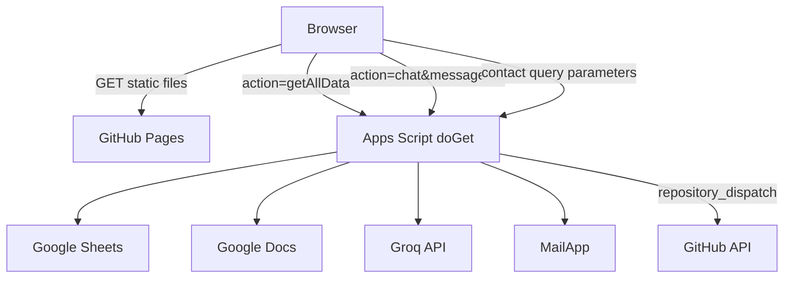
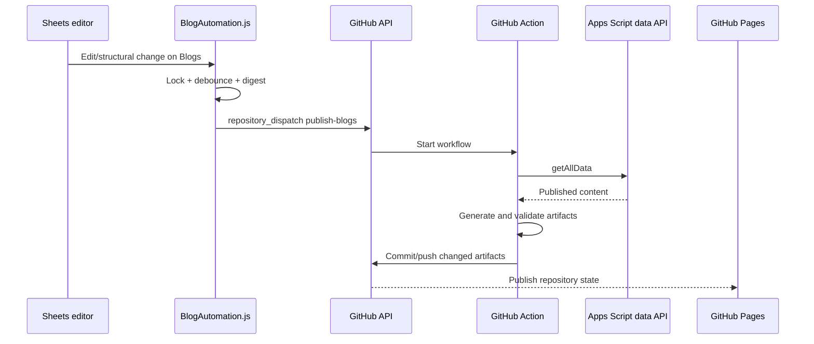

# Architecture

## System boundaries

The system deliberately combines a dynamic portfolio homepage with statically generated blog routes. GitHub Pages serves files only; all runtime data and mutations go through Apps Script.

## Frontend

`index.html` provides metadata, resource hints, script ordering, and component placeholders. `assets/js/component-loader.js` fetches all partials concurrently and emits `portfolio:components-loaded`. `assets/js/app.js` then applies SEO defaults, initializes third-party UI libraries, fetches portfolio data, renders sections, replaces icons, initializes chat/navigation/contact behavior, and dismisses the loader.

`assets/js/api.js` is the homepage data client. Feature renderers live in `assets/modules/`; shared sanitization and value helpers live in `assets/js/utils.js`. The browser rendering strategy is client-side DOM insertion into static component containers.

## Apps Script backend

`apps-script/Code.js` owns the public web-app router and business pipelines.

| Request | Backend flow | Response |
|---|---|---|
| `GET ?action=getAllData` | `doGet` → `compileAllPortfolioData` → sheet parsers and Google Docs enrichment | JSON portfolio dataset |
| `GET ?action=chat&message=...` | `doGet` → `executeGroqAiPipeline` → Sheets context → Groq | `{success, reply}` plus `raw` on provider failures |
| `GET` with contact fields and no action | `doGet` → contact pipeline → sheet row and emails | JSON response, although browser uses `no-cors` |
| `POST` chat JSON/form payload | `doPost` → AI pipeline | Same chat contract |
| Other `POST` | `doPost` → contact submission | Submission identifier or error |

There is no implemented `getBlog` case in `doGet`. Consumers attempt it, but fall back to `Content` already returned by `getAllData`.

## Google Sheets CMS

`MASTER_CONFIG.tabs` maps the tabs: Profile, Config, Skills, Projects, Experience, Education, Certificates, Blogs, FAQ, AI_CONTEXT, Submissions, and VisitorLog. Profile is parsed as one data row, Config as key/value pairs, and other sheets as header-driven tables. Projects and certificates are filtered on `Published`; blogs are filtered and optionally enriched from `DocID` or `GoogleDocID`.

The blog automation digest is header-driven and hashes only Title, Slug, Description, Content, Thumbnail, Category, Date, Published, Author, Keywords, UpdatedAt, DocID, and GoogleDocID. Blank rows, formatting, helpers, and unrelated columns are ignored.

## Blog generator

`blog/generator/blog-page-generator.js` is the orchestrator:

1. Reads `GAS_API_URL` from `assets/js/config.js`.
2. Fetches `?action=getAllData`, including support for a double-encoded JSON response.
3. Keeps published rows, resolves each slug from `Slug` or Title, and rejects duplicate/invalid slugs from output.
4. Uses returned content, with a best-effort `getBlog` fallback.
5. Sorts articles by date descending.
6. Renders the article template and generated blog index.
7. Updates the manifest.
8. Runs sitemap, RSS, and search-index generators concurrently.
9. Prints a JSON validation report consumed by GitHub Actions.

Generated content is sanitized, but scheduled dates are not used as a publication gate. A future Date can publish when `Published` is true.

## SEO, RSS, sitemap, and search

- `metadata-helpers.js` builds titles, descriptions, canonical URLs, Open Graph, Twitter, article dates, and keywords.
- `schema-helpers.js` builds Organization, BlogPosting, BreadcrumbList, Person, and WebSite JSON-LD.
- `seo.template.html` renders article metadata.
- `sitemap-generator.js` includes only blog routes whose static file exists.
- `rss-generator.js` creates RSS 2.0 items with content and optional media.
- `search-index-generator.js` indexes published blogs, projects, certificates, experience, and skills.
- `assets/js/search-engine.js` can query the generated index, but it is not currently loaded by `index.html` and has no visible search UI.

## AI chat

`executeGroqAiPipeline` compiles live portfolio data into one system prompt, appends the visitor message, and calls `https://api.groq.com/openai/v1/chat/completions`. The API key comes from `GROQ_API_KEY` in Script Properties. The success parser reads `choices[0].message.content`; provider failures are returned through the existing frontend-compatible reply field.

## Automated publishing

Apps Script installable On Edit and On Change triggers mark publishing pending. A 30-second debounced time trigger calculates the current digest and sends GitHub `repository_dispatch` event `publish-blogs`. Transient failures use deferred retries at 1, 5, and 15 minutes. GitHub Actions regenerates, validates, stages only the artifact allowlist, commits when changed, and pushes the current branch.

## Authentication and external APIs

The Apps Script web app is anonymously accessible and executes as the deploying user. Groq and GitHub credentials are server-side Script Properties. GitHub Actions uses its repository-scoped workflow token through `contents: write`; no repository secret is referenced by the workflow. Public CMS reads and contact/chat calls have no application-level authentication or rate limiting.

## Future architecture notes

Retain the static-first, framework-free design. Future work already described by project rules includes static project/certificate pages, pagination, category/tag routes, scheduled publishing enforcement, build reports, multilingual support, and visual regression checks. These are intentions, not current functionality. See [Roadmap](ROADMAP.md).
