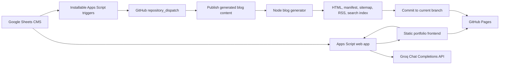

# Project Overview

## Purpose and business goal

This repository powers Md. Masum Billah's public portfolio at `https://itsmebillah.github.io/`. It presents profile data, skills, projects, certificates, experience, case studies, contact intake, and an AI portfolio assistant. Its business goal is to establish professional credibility, make portfolio content easy to update, and turn portfolio visits into contact opportunities.

## Current production status

The site is a production static website hosted on GitHub Pages. Portfolio content is fetched at runtime from a public Google Apps Script web app backed by Google Sheets. Blog articles are generated ahead of time and committed as static HTML. At the repository snapshot dated 2026-07-16:

- The manifest contains 11 published blog pages.
- `sitemap.xml` contains 13 URLs: home, blog index, and 11 articles.
- `rss.xml` contains 11 items.
- `search-index.json` contains 32 records across blogs, projects, certificates, experience, and skills.
- The chatbot uses Groq's `openai/gpt-oss-120b` model through Apps Script.
- Automatic blog dispatch and generation infrastructure is present.

Repository evidence cannot confirm the external GitHub Pages source setting, Apps Script deployment version, installed spreadsheet triggers, or current Script Properties. Verify those in their respective consoles before deployment.

## High-level architecture

## Tech stack

| Layer | Technology |
|---|---|
| Frontend | HTML, CSS, vanilla JavaScript |
| UI dependencies | Tailwind CDN, AOS, particles.js, Google Fonts |
| CMS | Google Sheets; optional Google Docs content via document IDs |
| Backend | Google Apps Script V8 web app |
| AI | Groq Chat Completions API |
| Static generation | Node.js scripts using built-in modules and native `fetch` |
| Automation | GitHub Actions and Apps Script installable triggers |
| Hosting | GitHub Pages |
| Source control | Git on `main` |
| Package manager | None; no `package.json` or installed runtime dependencies |

## Repository overview

- `index.html` is the homepage shell and static homepage SEO source.
- `components/` contains HTML partials loaded before application startup.
- `assets/` contains styles, configuration, shared browser logic, renderers, and images.
- `apps-script/` contains the backend, publishing automation, manifest, and a destructive sheet bootstrap utility.
- `blog/` contains templates, generators, the blog index, manifest, and generated pages.
- `.github/workflows/` contains automated blog publishing.
- Root feed and discovery files are generated artifacts.

See [Folder Structure](FOLDER_STRUCTURE.md) and [Architecture](ARCHITECTURE.md).

## External services

Google Sheets, Google Docs, Apps Script, GitHub REST API, GitHub Actions, GitHub Pages, Groq, Google Fonts, Tailwind CDN, AOS CDN, particles.js CDN, image hosts, Google Search Console, and outbound social/project links.

## Current deployment flow

Frontend changes follow a normal Git push to `main`, after which GitHub Pages publishes according to the repository's external Pages settings. Blog changes originate in Sheets, are debounced by Apps Script, dispatched to GitHub Actions, generated, validated, committed as artifacts, pushed, and then served by Pages. Apps Script backend changes require `clasp push` and updating the existing versioned web-app deployment. See [Deployment](DEPLOYMENT.md).
